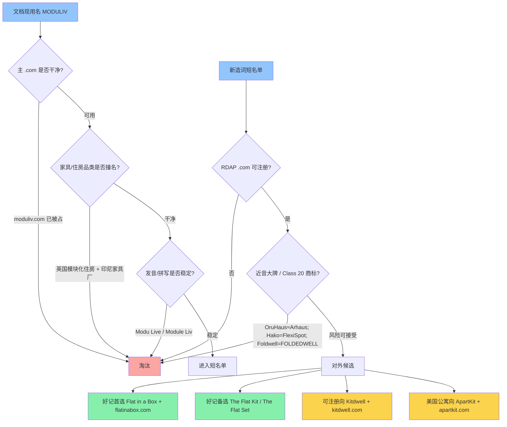
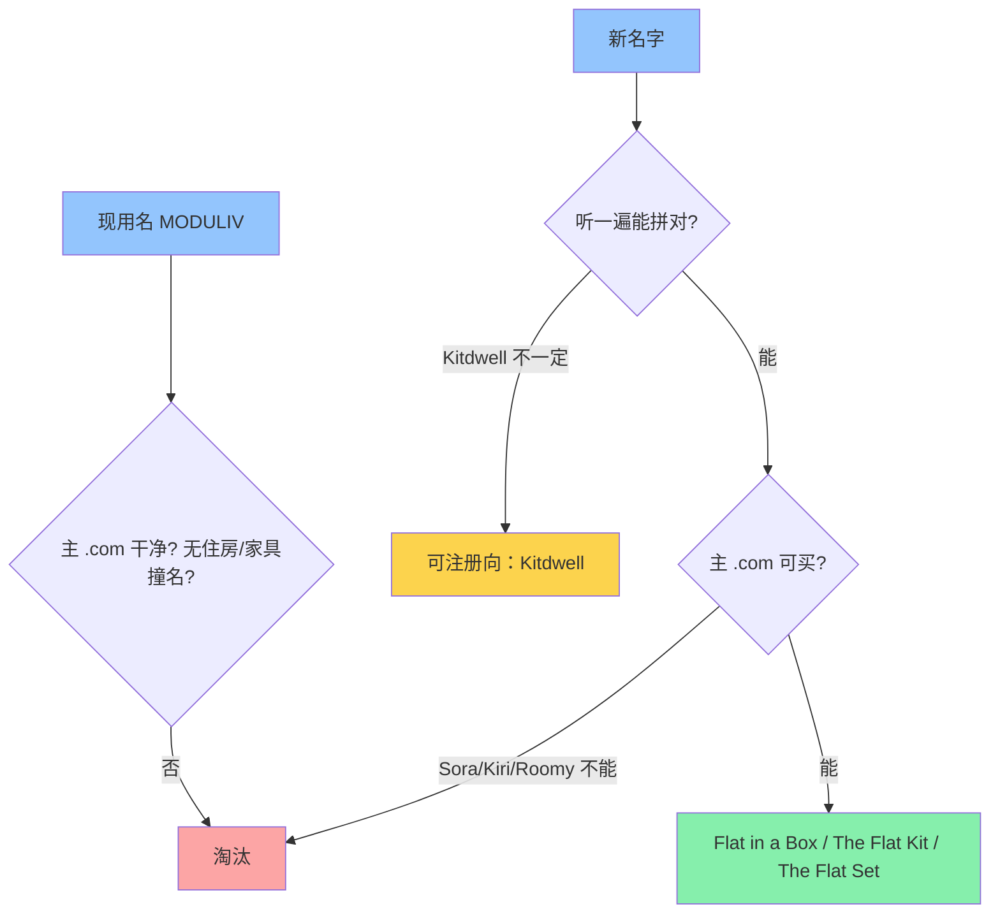

# PLAN-001 对外品牌名与主域名

> 状态：品牌与三枚 .com 已锁定，等待批准后改仓库文案  
> 范围：品牌名 + 对外主域名（不改产品线 SKU 命名）  
> 依据：`README.md`、`docs/01–05`、WHOIS/RDAP、公开商标/竞品检索（2026-09-02）

## 任务完成状态

- [x] 读完仓库品牌定位、文案、竞品与设计系统
- [x] 核验文档候选名的 `.com` 占用与品牌冲突
- [x] 给出主推品牌 + 主域名，以及 2 个可落地备选
- [x] 列出明确淘汰项与法律/心智风险
- [x] 按「好记」补一轮短词/短语检索（4–6 字母 .com 基本被占）
- [x] 七项加权综合打分（好记 / 调性 / 全球 / .com / 商标 / 全屋 / 广告）
- [x] 第二轮发散检索（北欧/日式短名、短语品牌、2026 新 DTC 撞名）
- [x] 用户确认最终品牌：The Flat Set
- [x] 已注册 `theflatset.com` / `myflatset.com` / `getflatset.com`（2026-09-02，GoDaddy，有效期至 2027-09-02）
- [ ] 律师做 USPTO / EUIPO Class 20 正式检索（顺带看 Flat by Artis 的 FLAT SET）
- [ ] 锁定 Instagram / TikTok / YouTube `@theflatset`
- [x] 已将 `my` / `get` 通过 Cloudflare 边缘 301 到 `theflatset.com`（2026-09-03）；品牌邮箱待单独配置
- [ ] 批准 Act 后：把文档与 Stitch 项目中的 MODULIV 换成 The Flat Set

## 核心结论（先看这个）

**不要用 MODULIV。**

**综合全部条件后，仍主推 The Flat Set + `theflatset.com`（加权 7.8 / 10）。第二轮发散检索没有找出综合分更高的名字。**

本轮新发现（会削弱备选，而不是推翻主推）：

- 德国 **ROOM IN A BOX** 已是家具品牌 → Flat in a Box 更不宜当公司名
- 西班牙 Flat by Artis 有隔墙产品 **FLAT SET** → The Flat Set 有一点搜索噪音，但不是同品类 DTC
- 2026 新品牌 Folke / LORVA / Mirewood 证明两音节造词有效，但干净短 .com 基本买不到
- `anafternoon.com` / `fromempty.com` / `pressflat.com` 可注册，但全屋表达更弱，且 Ideal Afternoon 已是家具工作室

七项权重：好记 20% · $1499/Japandi 调性 18% · 全球能懂 15% · 干净 .com 15% · 撞名/商标 12% · 接得住全屋不是沙发 12% · 广告能说 8%。

| 候选 | 总分 | 综合判断 |
| :--- | :--- | :--- |
| **The Flat Set** | **7.8** | 七项里没有短板到不及格；英美双关 + 全屋套餐 + 能拼 |
| Flat in a Box | 7.3 | 最好记，但调性和商标太差，只适合当广告句子 |
| The Flat Kit | 7.0 | 太像宜家 / kit home |
| Kitdwell | 6.9 | .com 和商标最好，记忆分太低 |
| Six Crate | 6.5 | 箱数不固定，还像 Crate & Barrel |
| ApartKit | 6.2 | 英国市场不及格 |

单独看好记会选 Flat in a Box；单独看商标会选 Kitdwell。**两头都算进去，门面仍是 The Flat Set。**

原因不是名字不好听，而是这个词已经无法干净地对外：

1. `moduliv.com` 已于 2021 年注册（意大利 Registrar + 英国代理隐私）。
2. 英国 **Moduliv Limited**（`moduliv.co.uk`）是模块化住房/MMC 公司，Google「Moduliv」会先撞上盖房子，而不是家具。
3. 印尼 **Moduliv**（`moduliv.co.id`）已是酒店/餐饮家具制造商。
4. 另有印尼 **Modulo Living** 全屋家具零售。听到、搜到、拼写都会混。
5. 发音不稳定：`MOD-yoo-liv` / `mo-DOO-liv` / `Modu Live`。

文档里的其他早期候选同样不适合做主站：

| 文档候选 | `.com` | 问题 |
| :--- | :--- | :--- |
| MODULIV | 已被占 | 住房公司 + 印尼家具厂同名 |
| FORMBOX | 已被占 | 2002 年起就在别人手里 |
| FLEXNEST | 已被占 | 印度健身品牌等占用 |
| SNAPLIVING / SNAPSOFA | 已被占 | 把品类锁死在「咔哒」，且偏廉价工具感 |
| ModuBox / LivinBox | 已被占 | 与 MODULIV 同一词根污染 |

## 品牌筛选标准（从本仓库抽出来的）

必须同时满足：

1. **全屋而不是沙发**：不能叫 SnapSofa。
2. **全球 DTC**：美/英欧/中东/澳都能读、能拼。
3. **Warm Japandi 社论风**：不能像工厂型号或 SaaS。
4. **$1,499 套餐信任**：主站必须是 `.com`，不用 `.home` / `.shop` / `.io` 做门面。
5. **能注册、能防御**：主域名可买，且没有近音大牌（Arhaus、Hako、Oru、FoldedWell、Dwellin App）。

## 好记向短名单（本轮新增）

4–6 字母的漂亮词（Unbox / Roomy / Sora / Kiri / Wren / Otto / Milo）`.com` 全部被占。好记只能走短语品牌。

| 排序 | 品牌写法 | 域名 | 好记原因 | 代价 |
| :--- | :--- | :--- | :--- | :--- |
| 1 | **Flat in a Box** | `flatinabox.com`（防御：`get*` / `the*` 也可买） | 听一遍就会；英=公寓进箱，美=平板装箱 | 描述性强，商标弱；要强调 whole home，避免被听成盒装沙发 |
| 2 | **The Flat Kit** | `theflatkit.com` | 三个常见词，和现有 slogan 同构 | `flatkit.com` 已被占，必须永远带 The |
| 3 | **The Flat Set** | `theflatset.com` | 比 Kit 更像成套家具 | 同上，必须带 The |
| 4 | ApartKit | `apartkit.com` | 美国租客好懂 | 英国说 flat 不说 apartment |
| — | Kitdwell | `kitdwell.com` | 不靠好记，靠能注册 | 要教用户怎么念、怎么拼 |

**Six Crate**（`sixcrate.com`）也算好记，但 Studio 是 4 箱、Airbnb 是 7 箱，数字会自己打脸，不进主名单。

## 主推方案

### 0. 锁定主推：The Flat Set

- **读法**：就是三个常见词，永远带 The
- **主域名**：`theflatset.com`
- **防御**：`getflatset.com`、`myflatset.com`（`flatset.com` 已被占，不要缩写成 FlatSet）
- **为什么是这个**：英国 flat=公寓，美国 flat=平板装；set=成套家具。文档里已经在卖 Full Home Set。比 Kit 不像宜家，比 Flat in a Box 更像品牌，比 Kitdwell 好记。
- **口播**：The Flat Set. Your entire home, delivered in flat boxes.
- **风险**：描述性仍偏强；Logo/邮箱/包装必须写全称 The Flat Set

备选：只做投放钩子时可用 Flat in a Box；只为商标干净才退回 Kitdwell。不双品牌并行。

---

### 1. 品牌名：Kitdwell（商标向备选，不主推）

- **读法**：就是英语短语，无造词
- **主域名**：`flatinabox.com`
- **防御**：`getflatinabox.com`、`theflatinabox.com`、`myflatinabox.com`
- **口播**：Your entire home. Flat in a box.
- **风险**：Swyft 等已占领 sofa-in-a-box 心智；视觉和文案必须是 **6 箱整套公寓**，不能只拍一张沙发膨胀

---

### 1. 品牌名：Kitdwell（推荐）

- **构词**：Kit（全屋套装 / Move-In Kit）+ Dwell（居住）
- **读音**：KIT-dwell（两音节，英美德法阿语市场都好念）
- **主域名**：`kitdwell.com`（Verisign RDAP 404，当前可注册）
- **防御域名**：`getkitdwell.com`、`thekitdwell.com`（均可注册）一起买下做跳转
- **邮箱 / 社媒**：`hello@kitdwell.com` / `@kitdwell`
- **可承接现有 slogan**：*Your Entire Home, Delivered in Flat Boxes.*
- **广告口播**：Shop Kitdwell. The 1-Bedroom Set. Six boxes. Zero tools.

**优点**

- 造词，比「The Flat Kit」更好注册商标。
- 精确命中仓库里的 **Move-In Bundles / Kit** 运营语言。
- 不锁死在沙发，可覆盖床、桌、柜、全屋。
- 主域就是品牌本身，不用靠 `the-` 前缀凑 `.com`。

**风险与对策**

| 风险 | 应对 |
| :--- | :--- |
| 英语世界有 “kit home”（装配式房屋），可能被理解成盖房子 | 视觉与 slogan 必须立刻落到家具/纸箱/客厅，不做建筑渲染 |
| Dwell 杂志是设计媒体强商标 | Kitdwell 作为整体造词通常可区分；仍需律师做 Class 20 检索 |
| 调性略偏功能，不如 The Citizenry 那么社论 | 用现有 Playfair + 暖瓷白 + 陶土 CTA 把名字「养」高级，而不是再起一个软名字 |

### 2. 审美备选：The Flat Set

- **主域名**：`theflatset.com`（可注册）
- **注意**：`flatset.com` 已被占，品牌必须永远带 **The**
- **英国双关极好**：flat = 公寓，也 = 平板包装 →「一套公寓家具」
- **更贴 Japandi 社论风**，像 The Citizenry / The Inside
- **弱点**：描述性更强，商标更难；口播必须说全称 The Flat Set

适合：你更在意品牌气质、主战场含英国，且能接受永远用 `theflatset.com`。

### 3. 美国公寓向备选：ApartKit

- **主域名**：`apartkit.com`（可注册）
- **双关**：apartment kit + come apart（可拆搬家）
- **弱点**：英国说 flat 不说 apartment；听起来偏工具产品，不像 $1,499 社论品牌

只在「先打美国租客、再考虑英欧」时才选。

## 明确淘汰（不要买来凑合）

| 名字 | 原因 |
| :--- | :--- |
| MODULIV | `.com` 被占 + 英国住房公司 + 印尼家具厂 |
| OruHaus | 与美国大家具零售 **Arhaus** 近音；Oru Kayak 已做折叠家具 |
| HakoHaus / Hakoliv | 日语「箱」很贴，但 FlexiSpot 已在 USPTO Class 20 申请 **HAKO**（家具） |
| Foldwell | USPTO 已注册家具商标 **FOLDEDWELL** |
| FormBox / FlexNest / SnapLiving | `.com` 不可用，且偏单品或廉价快装 |

## 域名策略（对外只认一个门面）

1. **门面**：`https://kitdwell.com`（或你最终选中的 `.com`）
2. **防御**：同名 `get*`、`the*`、常见拼错，301 到主域
3. **不要**用 `.home` / `.shop` / `.store` / `.io` 做独立站主域——大件家具要付 $1,499，用户会下意识检查是不是正规店
4. **全球站**：Shopify Markets / 多币种挂在同一个 `.com`；英德等到量起来再补 `kitdwell.co.uk` 等
5. **产品路径**：`kitdwell.com/bundles/1-bedroom`，不要再单独买一堆产品域名

## 代码 / 文档级变更指南（批准后才做）

不改商业模型、不改 SKU 内部代号（ModuSofa / SnapBed 可暂时保留）。只替换对外品牌层：

1. `README.md` 标题、Stitch 项目名：MODULIV → Kitdwell
2. `docs/01-brand-strategy-and-positioning.md` 定位陈述与 slogan 署名
3. `docs/02-brand-copywriting-master-guide.md` 命名表、宣言、包装印刷、EDM、`@ModuLivHome`
4. `docs/03` / `04` 中的品牌叙事称呼
5. `docs/05-stitch-ui-and-design-system.md` 的 Stitch Title
6. 包装箱 TOP PANEL、欢迎卡、邮件 From Name

**不要**把产品系统名（Seating / Surface / Bedroom）一起改掉。那是品类架构，不是品牌。

## 潜在风险

- **RDAP 不是下单**：404 表示当前未注册，但抢注窗口以支付成功为准。批准后应立即在 Registrar 下单。
- **商标检索是律师活**：本次仅为公开网页/数据库粗查，不能当法律意见。
- **Handle 未锁**：域名可买不等于 Instagram/TikTok 可用，需同步查。
- **Stitch 工程已全部写成 MODULIV**：换名是文案层，设计系统 tokens 不用动。

## 测试策略

品牌名无法写单元测试，用这套「对外可上线」检查：

1. **朗读测试**：美国人、英国人、非母语者各听一次，能否一次拼对。
2. **搜索测试**：Google / Instagram / USPTO TESS / EUIPO 搜最终名，前 10 条不能出现同业家具或住房公司。
3. **信任测试**：把 `kitdwell.com` 放进结账页模拟，对比 `kitdwell.shop` 是否更像正牌店。
4. **文案测试**：现有 Master Slogan 能否不加改写就印在箱面。
5. **冲突测试**：与 Burrow / Cozey / Arhaus / IKEA / Dwell 杂志并排，是否被当成山寨。

## 批准后执行顺序

1. 你确认三选一（默认 Kitdwell）
2. 立即注册 `.com` + 2 个防御域
3. 查并占用社媒 handle
4. 委托商标检索
5. 再改仓库文档与 Stitch 项目名
