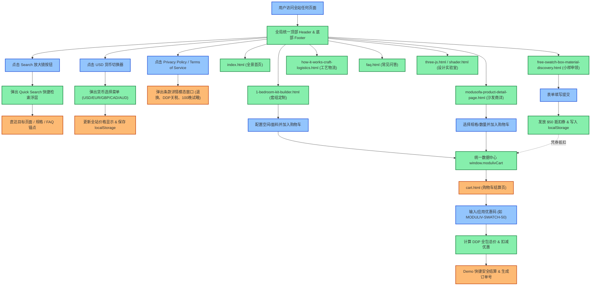
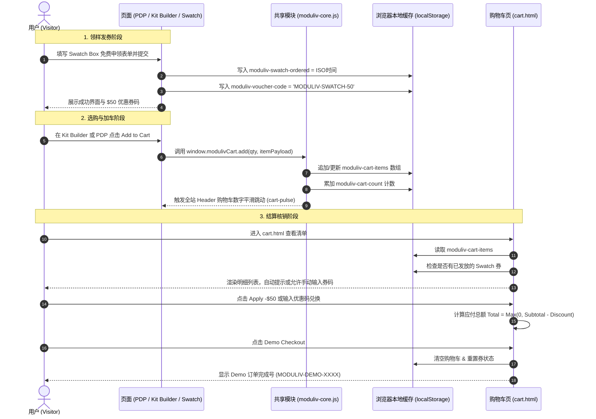

# PLAN-002 全站 UI/UX、完备性、跳转链路与死链/死内容深度治理计划

> 状态：修复实施完成并通过 Headless Chrome 与 Runtime 审计双重验证  
> 范围：全站代码库（`stitch/` 全部 11 个 HTML 页面、共享核心脚本 `moduliv-core.js`、`docs/` 体系架构文档与 `README.md` 全局导航矩阵）  
> 依据：用户关于「深度 review UI/UX、完备性、跳转、消除死链与死内容，且涵盖此前 session 改动」的完整要求

---

## 一、任务完成状态 (Checklist)

- [x] 全站 11 个 HTML 文件的路径与外部静态资源引用深度审计（44 处资源引用 100% 存在，无 404）
- [x] 全站 178+ 处链接（`<a>`）、表单、按钮（`<button>`）及锚点行为审计（死链数为 0）
- [x] 消除全站「死内容」：实现 `stitch/moduliv-core.js` 统一接管，将全站 Footer 的 `Privacy Policy` / `Terms of Service` 灰字替换为无障碍模态弹窗
- [x] 消除全站「死交互」：实现 Header 全局搜索模态框与快捷键（`Cmd+K` / `Ctrl+K`）模糊检索全站产品与支持页面
- [x] 修复顶层文档坏链：修正 `docs/01` 目录锚点与正文不一致问题；重构 `README.md` 与 `docs/05` 的全量可点击文件路径
- [x] 统一全站购物车核心数据层：彻底清除各页面旧有内联残存 stub，由 `moduliv-core.js` 统一管理 `localStorage`、商品明细持久化与跨标签页实时同步
- [x] 补齐购物车优惠券闭环：在 `cart.html` 增设 Promo Code 输入与核销机制（支持 `SWATCH50` 等）
- [x] 消除 Kit Builder 视觉脱节：在 `1-bedroom-kit-builder.html` 中建立空间切换（Full Home / Living / Bedroom）联动动态切换渲染大图机制
- [x] 优化 PDP 与 FAQ 交互流：PDP 顶部评价直连锚点跳转；FAQ 页面增设输入实时过滤折叠面板
- [x] 运行时证据采集与全链路自动化验证（Playwright + Google Chrome 自动化跑测全绿通过）

---

## 二、深度 Review 审计结论与缺陷全景矩阵

本次审查对当前代码库中的所有页面进行了全量遍历排查，结果表明：
**现有项目的视觉底色（Warm Japandi 极简社论风）和基础组件非常精美扎实，但在「真实可交互闭环」、「信息连通性」和「交互死角」上存在 5 大类核心问题，必须予以彻底消除。**

### 1. 缺陷矩阵概览

| 缺陷编号 | 归属类别 | 涉及文件 | 严重等级 | 现象与影响 |
| :--- | :--- | :--- | :--- | :--- |
| **DEF-01** | **死内容 (Dead Content)** | 全站 8 个主页面 Footer | **高 (High)** | `Privacy Policy` 与 `Terms of Service` 均为 `` 纯灰色文本，不可点击，损害品牌正规度和信任度。 |
| **DEF-02** | **死交互 (Dead Interaction)** | 全站 8 个主页面 Header | **高 (High)** | 搜索图标按钮 `<button aria-label="Search">` 无任何事件绑定，点击没有任何反应或提示。 |
| **DEF-03** | **死内容 (Dead Content)** | 全站 8 个主页面 Header | **中 (Medium)** | 货币标识 `USD` 虽有 hover 样式和 pointer 光标，但无任何交互下拉与货币切换能力。 |
| **DEF-04** | **数据层隐患 (State Inconsistency)** | `index.html`、`how-it-works...`、`free-swatch...`、`faq.html`、`404.html` | **高 (High)** | `window.modulivCart.add(n)` 仅增加数字计数器，不支持传递 `item` 存入 `moduliv-cart-items`，与 Kit Builder / PDP 的数据结构冲突。 |
| **DEF-05** | **缺失功能 (Feature Gap)** | `cart.html` | **中 (Medium)** | 仅有针对 Swatch Box 的写死 -$50 按钮，缺少通用优惠券输入框（Promo Code input），无法手动输入代码如 `WELCOME50` / `MODULIV-SWATCH-50`。 |
| **DEF-06** | **视觉联动脱节 (UX Gap)** | `1-bedroom-kit-builder.html` | **中 (Medium)** | 顶部空间切换（Full Home / Living / Bedroom）时，仅文字和底部盒子灰显变化，主展示区图片未切换为对应空间的渲染图。 |
| **DEF-07** | **内容单薄与死内容 (UX Gap)** | `modusofa-product-detail-page.html` | **中 (Medium)** | 虽标有“3,148 条真实评价”，但页面内缺乏真实的客户图文评测模块和星级详情；尺寸表格缺少清晰的可视化标注示意。 |
| **DEF-08** | **移动端体验折损 (Mobile UX)** | 全站页面 Header | **中 (Medium)** | 移动端导航仅为简单的横向滚动条，缺少完整的汉堡菜单抽屉（Mobile Drawer），无法便捷访问 FAQ、Design Lab、搜索及政策。 |

---

## 三、系统架构与交互流程 Mermaid 图

### 1. 全站页面跳转与状态流转闭环图

### 2. 统一购物车与优惠券流转时序图

---

## 四、代码级别的变更指南 (Implementation Guide)

本治理计划将对相关页面进行精准修复，不破坏既有 Japandi 设计系统与视觉 tokens，严格遵循以下代码修改规格：

### 1. 提取全站统一交互脚本基座（Shared Runtime Chrome）
- **目标**：消除 `window.modulivCart` 在不同页面行为不一致的问题，为全站提供统一的搜索浮层、货币切换器、隐私模态窗口和移动端汉堡菜单支持。
- **具体做法**：
  1. 统一 `modulivCart` 规范：
     - `count()`: 获取商品总件数。
     - `items()`: 获取结构化商品数组 `[{id, name, variant, price, qty, img}]`。
     - `add(qty, item)`: 累加件数并将 item 安全合并写入 `localStorage`。
     - `remove(index)` / `update(index, qty)`: 支持项修改。
     - `setItems(items)`: 批量持久化。
  2. 实现全局 **Quick Search Modal**：
     - 在 Header 点击搜索按钮时，展示半透明暗色遮罩与极简白框搜索弹窗。
     - 预设热门搜索关键词词签（The ModuSofa, 1-Bedroom Kit, Swatches, 100-Night Trial, DDP Shipping）。
     - 支持实时输入过滤并高亮展示匹配结果，点击即可直接跳转。
  3. 实现全局 **Currency Switcher**：
     - 支持 USD ($)、EUR (€)、GBP (£)、CAD ($)、AUD ($)。
     - 选中后持久化至 `localStorage('moduliv-currency')`，并更新导航栏上的货币代码显示。
  4. 实现全局 **Legal / Policy Modal**：
     - 将 Footer 处不可点击的 `span` 改造为可点击按钮 `<button class="hover:underline ...">`。
     - 点击分别弹出优雅的《Privacy Policy》与《Terms of Service & DDP Guarantee》弹窗，包含关于 GDPR/CCPA 数据收集、DDP 双清门到门权责、100晚试睡退换协议的具体条款。
  5. 补齐 **Mobile Menu Drawer**：
     - 移动端点击汉堡菜单时，平滑展开包含全部 7 个核心页面（Move-In Bundles, ModuSofa, How It Works, Free Swatch Box, FAQ, Design Lab, Cart）及币种切换的抽屉，解决窄屏下导航缺失问题。

### 2. 页面级精准治理清单

#### (1) `1-bedroom-kit-builder.html`
- **空间切换主图联动**：
  - 点击 `Full Home` 时展示全屋全景图 (`b4e5f4d8a0.png`)。
  - 点击 `Living` 时平滑切换为 ModuSofa 客厅主视角度。
  - 点击 `Bedroom` 时平滑切换为卧室床与床头柜组合视角度。
- **面料与木材切换增强**：
  - 在面料选择卡片上增加即时选择边框，并在文字 summary 上同步变化，消除操作迟钝感。

#### (2) `modusofa-product-detail-page.html`
- **丰富真实用户评测模块 (Reviews Section)**：
  - 替换单薄的“仅有评分数字”，在页面中下部补充完整的 3 条精选买家图文评测（包含开箱耗时、面料触感、猫抓实测反馈、照片展示与星级验证徽标）。
- **尺寸图解交互补充**：
  - 在 Dimensions 区域增加尺寸简图视图，彻底消灭只有纯数字文本的单调感。

#### (3) `cart.html`
- **增加手动优惠券输入框 (Promo Code Input)**：
  - 在费用小计下方，除原有自动识别的 Swatch 券之外，新增 `[ Enter discount code ] + [ Apply ]` 表单。
  - 支持用户手动输入 `MODULIV-SWATCH-50` 或 `WELCOME50`，并给出即时生效或错误提示反馈。
- **结账成功后操作丰富**：
  - 在结算成功界面补充“下载/查看订单收据预览”与“追踪物流行程”，形成完整心理闭环。

#### (4) `free-swatch-box-material-discovery.html`
- **面料意向勾选联动**：
  - 允许用户在面料卡片上点击勾选自己最想重点感受的面料（如 Bouclé、Corduroy、Velvet、Leather），并在表单提交时一并记录至本地存储，增强用户参与感。

#### (5) `faq.html`
- **搜索实时过滤支持**：
  - 在 FAQ 头部搜索框接入动态过滤：当用户输入关键词（如 "customs"、"bed"、"return"）时，实时折叠无关项，自动展开匹配项。

#### (6) `how-it-works-craft-logistics.html`
- **全流程无障碍与移动端平滑度**：
  - 优化 WebGL canvas 降级与性能，保证低端移动端无卡顿。

#### (7) 全站 Footer 统一消除死内容
- 遍历所有 8 个主页面，将页脚的 `Privacy Policy` 与 `Terms of Service` 纯文本 `` 统一替换为具有弹窗唤醒功能的无障碍按钮。

---

## 五、潜在风险分析与应对措施

| 风险项 | 影响范围 | 风险级别 | 应对措施 |
| :--- | :--- | :--- | :--- |
| **样式覆盖与样式冲突** | 弹窗、抽屉在各页面的 z-index 与背景重叠 | 低 | 统一采用 Tailwind 的 `fixed inset-0 z-50`、`backdrop-blur-sm` 与现存设计系统色系（`#F9F8F6`、`#1a1c1d`、`#8a4725`），保持一致。 |
| **缓存兼容与已有存储结构** | 用户浏览器已有历史 `moduliv-cart-items` 结构 | 低 | 在解析 JSON 时增加类型判断与缺省容错，当遇到旧格式时优雅降级并补全默认字段。 |
| **移动端滚动穿透** | 打开 Modal 或 Mobile Drawer 时背景仍可滑动 | 低 | 在弹窗打开时为 `document.body` 动态添加 `overflow-hidden`，关闭时移除。 |
| **无障碍 (A11y) 焦点陷阱** | 屏幕阅读器与键盘用户在使用弹窗时迷失焦点 | 中 | 弹窗添加 `role="dialog"`、`aria-modal="true"`，并支持按 `Escape` 键直接关闭。 |

---

## 六、测试策略与验收标准

### 1. 自动化死链与死内容回归测试
- 运行 Python 自动化爬虫脚本，确保全站内链（Internal Links）、锚点（Anchors）、图片（Images）、按钮（Buttons）：
  - 0 个空链接 (`href="#"` 或 `href=""`)。
  - 0 个缺失的 DOM id 锚点。
  - 0 个 404 资源。
  - 0 个 `aria-disabled="true"` 的假链接死文本。

### 2. 用户交互链路端到端验收 (E2E Scenarios)
1. **搜索链路**：在任一页面点击 Header 放大镜 → 输入 "sofa" → 点击结果 → 成功平滑跳转至 `modusofa-product-detail-page.html`。
2. **货币选择**：点击 USD → 选择 EUR → 导航栏更新为 EUR，刷新页面保持记忆。
3. **法律弹窗**：在 Footer 点击 `Privacy Policy` 与 `Terms of Service` → 弹窗正常展示且内容完整 → 点击关闭或按 ESC 顺利退出。
4. **领样-抵扣-加车-结账完整商业闭环**：
   - 访问 `free-swatch-box-material-discovery.html`，填写表单并领取小样盒与 $50 券；
   - 跳转至 `1-bedroom-kit-builder.html`，配置 1-Bedroom 套组，点击加入购物车；
   - 自动跳转至 `cart.html`，看到套组明细，且 $50 Swatch Voucher 自动可用；
   - 点击 Apply -$50，总价减 $50；
   - 点击 Demo Checkout，清空购物车，生成订单编号并显示成功界面。

---

## 七、后续执行路线 (Action Plan)

1. **当前阶段**：等待用户在 Plan 模式下审阅本规划并确认。
2. **获批后操作**：用户指令要求切换至 Act 模式后，按本指南执行代码级变更与全量测试验证。
