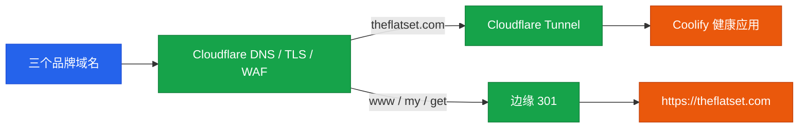

# PLAN-005 Cloudflare DNS 与 Tunnel 迁移

> 状态：已完成（2026-09-03）
> 范围：`theflatset.com`、`myflatset.com`、`getflatset.com`
> 注册商：GoDaddy（保持不变）
> 权威 DNS 与入口：Cloudflare

## 当前结论

- [x] 三个域名当前使用 GoDaddy `domaincontrol.com` Nameserver
- [x] 当前未发现 MX、AAAA、DS；保留了三个 Zone 原有的 `_dmarc` TXT
- [x] 确认健康 Coolify 应用：`bekn9ilvhou0xzzg3s63khsp`
- [x] 确认其现有入口 `https://flatpack.dev.canbee.cn` 与 `/api/health` 返回 200
- [x] 排除外部返回 503 的 `flatpack-xinvise.dev.canbee.cn`
- [x] 确认已安装的 GoDaddy CLI 0.2.12 支持 v3 Nameserver 更新

## 实施任务

- [x] 导出并保存三个 GoDaddy Zone 的迁移快照
- [x] 创建三个 Cloudflare Zone 并核对导入记录
- [x] 创建远程管理的 Cloudflare Tunnel
- [x] 在健康 Coolify 实例所在服务器部署 `cloudflared`
- [x] 配置 `theflatset.com` 通过 Tunnel 到达应用
- [x] 配置 `www`、`my`、`get` 到主域的永久重定向
- [x] 切换三个域名的 GoDaddy Nameserver
- [x] 验证 DNS、TLS、Tunnel、页面和健康探针
- [x] 最后更新生产 URL 环境变量并重新部署
- [x] 完成后更新品牌域名计划状态

## 目标流量

## 风险控制

- 切换前保持 GoDaddy 原 Zone 不变，以便快速恢复旧 Nameserver。
- 以 GoDaddy API 完整导出为准，不依赖 Cloudflare 自动扫描猜测记录。
- Tunnel 通过宿主机内网 `192.168.1.50:443` 和 Coolify Host 路由访问应用，不通过公网回绕。
- 所有 Token 仅通过授权会话或环境变量使用，不写入仓库。
- 防御域名使用边缘重定向，避免给源站增加无意义依赖。

## 验收

- [x] Cloudflare Tunnel 状态 healthy（4 条连接）
- [x] 三个 Cloudflare Zone 状态 active
- [x] 主域和 `/api/health` 返回 200
- [x] `www`、`my`、`get` 返回 301 并保留路径和查询参数
- [x] TLS/SNI 正常，三个 Universal SSL 证书 active
- [x] 首页、语言套件页、购物车和 Payload Admin 正常
- [x] 三个生产公开 URL 环境变量已更新并完成重新构建
- [x] 未泄露任何 Cloudflare、GoDaddy 或 Tunnel 凭据
