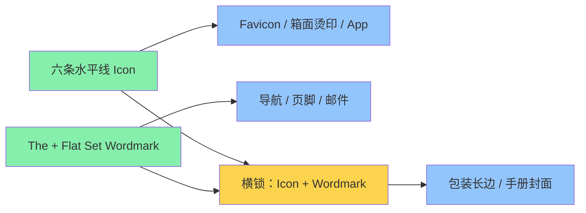
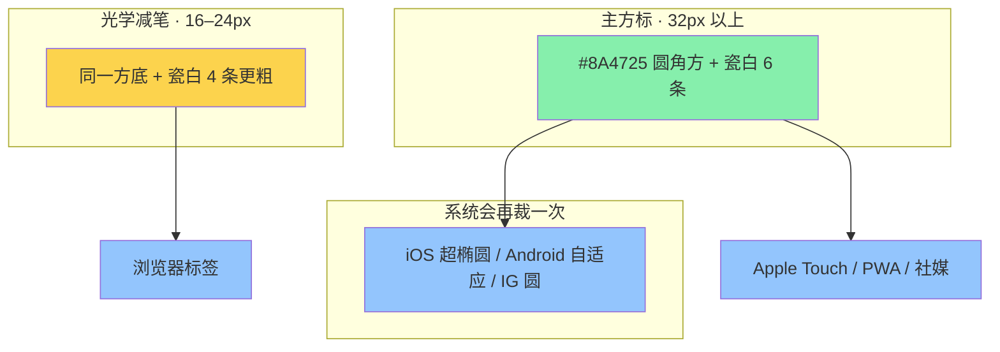

# PLAN-005 The Flat Set 视觉识别（VI）

> 状态：VI 终稿已落地（描边字标、6×1px favicon、系统字栈）。俄文西里尔正文仍待补。
> 原则：**不另起一套视觉**，把现站 Warm Japandi Editorial 升格为品牌 VI  
> 品牌：The Flat Set · 门面 `theflatset.com`

## 任务完成状态

- [x] 对照 `stitch/index.html`、`stitch/DESIGN-SYSTEM.md`、`docs/05` 抽出在位视觉
- [x] 写出完整 VI 方向（标志、色、字、应用、禁则）
- [x] 批准 Act
- [x] 产出 `stitch/brand.html` 品牌手册页（可点、可印）
- [x] 产出 SVG：Wordmark / Stacked / Icon / Favicon / 单色牛皮纸版
- [x] 全站 Header / Favicon / OG / 页脚 从 MODULIV 换成 The Flat Set
- [x] `docs/06-brand-vi.md` 写入规范，供包装和社媒沿用
- [x] Next.js 生产组件、i18n 多语言词条与 Payload CMS 全局设置同步升级
- [x] 触发 Coolify 自动化部署并完成线上验收

## Design Read

Reading this as: **premium consumer DTC 品牌识别**，给都市租客 / 首套房 / Airbnb 房东，语言是 **Warm Japandi 社论风**，视觉权威是 **现有 Stitch 站点**，不是重做一套。

拨档（相对现站）：`VARIANCE 6` · `MOTION 4` · `DENSITY 3`。VI 比页面更静，标志几乎不动。

## 在位视觉（必须继承，不许另发明）

从现站和 `DESIGN-SYSTEM.md` 抽出、已经在跑的系统：

| 角色 | 现站值 | VI 里怎么用 |
| :--- | :--- | :--- |
| 画布 | Warm Porcelain `#F9F8F6` | 站、手册、信封、社媒底 |
| 墨色 | Basalt Charcoal `#1A1C1D` | 标志主色、主按钮、标题 |
| 强调 | Terracotta `#A85F3B`（公告条、主容器） | 戳记、促销、现压指示；**不是标志主色** |
| 深陶土 | `#8A4725`（现站 `primary`） | 深底反白、hover、favicon 底 |
| 鼠尾草 | Soft Sage `#545C50` | ESG / 现压认证，不进 Logo |
| 发丝线 | Hairline Stone `#EBEAE8` | 网格、名片分割 |
| 抬升面 | `#FFFFFF` | 卡片、弹层 |
| 展示字 | Playfair Display 500/600 | **Wordmark 与大标题同一家族** |
| 正文字 | Plus Jakarta Sans 400/600 | 导航、参数、包装小字 |
| 标签 | Jakarta 12–14px，大写，`0.05em` | 「THE WHOLE-HOME SYSTEM」等眉题 |
| 网格 | 1440 / 12 栏 / 8px | 手册页与站点同一套 |
| 圆角 | 按钮 4px 规范，现站主 CTA 实际是 `rounded-full` | VI 跟**现站实测**：主按钮胶囊，卡片 8px |
| 阴影 | `0 4px 20px rgba(26,28,29,0.04)` | 不进印刷；印刷只用油墨与纸色 |

现站 Logo 现状：导航里一行大写 Playfair `MODULIV`，favicon 是陶土圆角方里一个 **M**。这两处必须换，色和字不换。

## 标志系统

### 核心概念：六条水平线 = 六只平板箱

不画房子、不画沙发、不画字母 F。一条线就是一只箱子的侧面。六条线叠在一起，就是「整套家，装进平板箱」。和首页 Hero「6 个牛皮纸箱」同构。



### Wordmark（主标志，导航用这个）

- 必须写全称 **The Flat Set**，禁止 `FLATSET` / `FlatSet` / 丢掉 The。
- 「The」：Playfair Display Italic，字号约为「Flat Set」的 55–60%，字距略松。
- 「Flat Set」：Playfair Display Semibold 600，Title Case，tracking `-0.02em`（与现站 Display 标题一致）。
- 颜色：Basalt `#1A1C1D` 印在 Porcelain 上；反白印在 Basalt 或深陶土上。
- **不用**现站 MODULIV 的全大写 + `tracking-tighter`：The 会被吃掉，品牌法理上必须带 The。

导航两种锁头：

1. **单行（桌面）**：`The Flat Set` 同一基线，「The」斜体较小。
2. **两行（移动 / 窄）**：上行 `The`，下行 `Flat Set`，左对齐。

### Icon（六板印，裸标）

- 正方形视框，六条等长水平线，线粗与间隙按 8 的网格（例如线 3、隙 5）。
- 最下面一条可略短 8%，暗示「最底下那只箱子推进门」。不要画透视，不要圆角条。
- 只用于锁头、牛皮纸烫印、手册。最小使用边长 24px。**不直接当 favicon。**
- 单色牛皮纸：只印 Basalt 或只印陶土，六线，无底。

### 方图标（Tile，书签栏 / App / 社媒头像）

方标是**独立磁贴**，不是把 Wordmark 或裸六线裁进方框。现站已经是 `64×64`、`rx=12`、底色 `#8A4725`、瓷白图形——底、圆角、色值全部继承，只换里面的 M。



**主方标 `icon-tile.svg`（32px 及以上）**

| 项 | 值 | 原因 |
| :--- | :--- | :--- |
| 视框 | `64×64` | 与现 favicon 同一文件规格 |
| 底 | `#8A4725` 直角坐标圆角 `rx=12` | 书签栏看起来还是同一家人 |
| 图 | `#F9F8F6` 六条等长水平条 | 与裸标同构 |
| 安全区 | 四周各留 `12`（内区 `40×40`） | iOS/Android/IG 会再裁成圆或超椭圆，线不能贴边 |
| 条带 | 条高 `4`、间隙 `3`，上下余 `1` 均分 | 整数，缩放不抖 |
| 底条 | **不缩短** | 方框里短一条会像画坏了；短底条只给裸标 |

**Favicon 光学减笔 `favicon.svg`（16–24px）**

六条线缩到 16px 每条不到 1px，Chrome 会糊成灰斑。官方减笔，不是另一套 Logo：

- 同一陶土方底、同一 `rx=12`
- 内区仍 `40×40`
- **四条**瓷白条：条高 `6`、间隙 `5`
- 禁止在 16px 格里写字母、描边、阴影

**导出清单**

| 文件 | 用途 |
| :--- | :--- |
| `mark.svg` | 裸六线，锁头 / 印刷 |
| `icon-tile.svg` | 主方标，32px+ |
| `favicon.svg` | 四条减笔，浏览器标签 |
| `apple-touch-icon.png` 180 | 主方标栅格 |
| `icon-512.png` | PWA / Android |

**明确不做**

- 不把 Wordmark 塞进方框
- 不写 T / F / 六个点
- 方底不用促销陶土 `#A85F3B`（现站 primary 是更深的 `#8A4725`）
- 不给方标单独换圆角语言；网页 `rx=12`，系统图标交给 OS 蒙版

### 明确不做

- 不把陶土当 Logo 主色（现站主按钮是 Basalt，陶土是公告/促销）。
- 不画乐高块、沙发剪影、房子轮廓。
- 不加 slogan 进标志。Slogan 单独出现：*Your Entire Home, Delivered in Flat Boxes.*
- 不拉伸、不加阴影、不放进渐变、不描金。

## 色彩角色（站点已有，VI 只分层）

```
主识别     Basalt #1A1C1D     标志、主按钮、标题
画布       Porcelain #F9F8F6  底
强调/促销  Terracotta #A85F3B  公告条、价签、现压点
深强调     Oak Burnt #8A4725  favicon 底、深悬停（现站 primary）
认证       Sage #545C50       ESG / 有机 / 现压
结构       Stone #EBEAE8      线
抬升       White #FFFFFF      卡片
```

印刷：CMYK 近似由落地时出一版；牛皮纸上只用单色黑或单色陶土。

## 字体

与现站 1:1，不引入第三款字。

| 用途 | 字体 | 现站 token |
| :--- | :--- | :--- |
| 标志、Hero、章节标题 | Playfair Display 500/600 | `display-lg` / `headline-*` |
| 正文、FAQ、产品说明 | Plus Jakarta Sans 400 | `body-md` / `body-lg` |
| 导航、眉题、按钮、箱面参数 | Plus Jakarta Sans 600，大写 0.05em | `label-md` |

网页继续用现成 `stitch/vendor/fonts`。包装/PPT 许可：Playfair Display 与 Plus Jakarta Sans 均为 OFL，可商用嵌入。

## 多语言字体（三方 review 后改写，2026-09-03）

审过：Impeccable / Codex taste / Claude frontend-design / agy Gemini 3.8 Flash。共识如下。**不再自托管 Noto CJK / Naskh。**

字标 **The Flat Set** 永远英文 Playfair，不译、不换字。拉丁两套锁定。中日阿语走系统黑体，排在 Playfair / Jakarta 后面。

```
标题  "Playfair Display", "PingFang SC", "Hiragino Sans", "Yu Gothic", "Microsoft YaHei", Georgia, serif
正文  "Plus Jakarta Sans", "PingFang SC", "Hiragino Sans", "Yu Gothic", "Microsoft YaHei", system-ui, sans-serif
```

| Locale | 本地字怎么来 | 注意 |
| :--- | :--- | :--- |
| en / de | Playfair + Jakarta | 已覆盖 |
| ru | 标题 Playfair 西里尔；正文 Jakarta **无西里尔** | 仍要补一档西里尔无衬线，或先靠 system-ui |
| zh / ja | 系统黑体（0kb） | 标题不用宋体；Windows YaHei 会偏冷，接受 |
| ar | 系统阿语 + `dir=rtl` | 行高 1.8；不托管 Naskh |

配套：

- `[lang|=zh] / ja / ar` 的原生文案关掉 `uppercase` + `0.05em`；`BOX` / `DDP` / `$` 用 `.latin-meta` 保留 Jakarta 大写
- 字标 SVG 必须描成 path，禁止靠网页字体
- stitch 首页改挂 `fonts-7cdb80a7.css`，消灭假斜
- Favicon **保持 6 条**，16px 用 1px 条 + 1px 隙对齐像素格；**不做四条减笔**（会变成第二套标）
- 禁止把完整 Noto CJK 打进包（15MB+，打死 LCP）

## 应用（第一批要出的物料）

1. **站点**：顶栏 Wordmark、favicon、页脚、OG 图标题、邮件 From 名。
2. **品牌手册页** `stitch/brand.html`：色板、字阶、标志最小尺寸、正确/错误示例、箱面示意图。
3. **牛皮纸箱**：顶面六线 Icon + 长边 Wordmark + 侧边 `1-PERSON LIFT` 标签（现站 trust 条语言）。
4. **社媒头像**：陶土底 + 瓷白六线（与 favicon 同构）。
5. **面料小样盒**：Wordmark 压在盒盖，内卡用 Jakarta 小字。

## 代码级变更指南（批准后）

- 新建 `stitch/assets/brand/`：`wordmark.svg` `wordmark-on-dark.svg` `mark.svg` `icon-tile.svg` `favicon.svg` `lockup.svg`
- 新建 `stitch/brand.html`：手册，复用现站 tailwind token，不另起 CSS 主题
- 全站 `<a class="font-headline-sm ...">MODULIV</a>` 换成 Wordmark SVG（至少：index、builder、pdp、swatch、how-it-works、cart、faq、404、gallery）
- `<title>` / JSON-LD `Organization.name` / og:title 里的 MODULIV → The Flat Set
- Favicon data-URI 换成新 `favicon.svg`
- **不动**：产品名 ModuSofa / SnapBed、Tailwind 色板、按钮形状、摄影、版心
- **不改**：`moduliv-core.js` 的 localStorage key（避免清掉用户购物车）；内部 ID 可留

## 风险

| 风险 | 对策 |
| :--- | :--- |
| 「The Flat Set」比 MODULIV 长，顶栏挤 | 桌面单行锁头，`<768px` 改两行；不缩成 FlatSet |
| Playfair 斜体「The」在部分浏览器偏细 | 手册规定最小字号 14px；更小只用 Icon |
| 六线 Icon 像汉堡菜单或条码 | 线宽/间隙固定，禁止缩到 16px 以下而不加陶土底 |
| 与现站 CTA 圆角规范文案不一致 | VI 跟**页面实测**胶囊按钮，不跟 DESIGN-SYSTEM 里过时的 4px 按钮句 |

## 测试

1. 顶栏：桌面 1440、平板 768、手机 390，Wordmark 不换行错乱、不与导航重叠。
2. favicon 16px：四条减笔仍可读成「一叠板」；32px 主方标六线可数清。
3. 牛皮纸单色复印：Wordmark 与 Icon 仍成立。
4. 对比现站首页：除标志和标题里的品牌名外，色、字、按钮、留白无感变化。
5. 手册页与首页并排，色值一致。

## 批准后顺序

1. 画 SVG 标志四件套  
2. 做 `stitch/brand.html`  
3. 换全站 Header / Favicon / 文档品牌名  
4. 浏览器核对首页 + 手册 + 移动顶栏  
