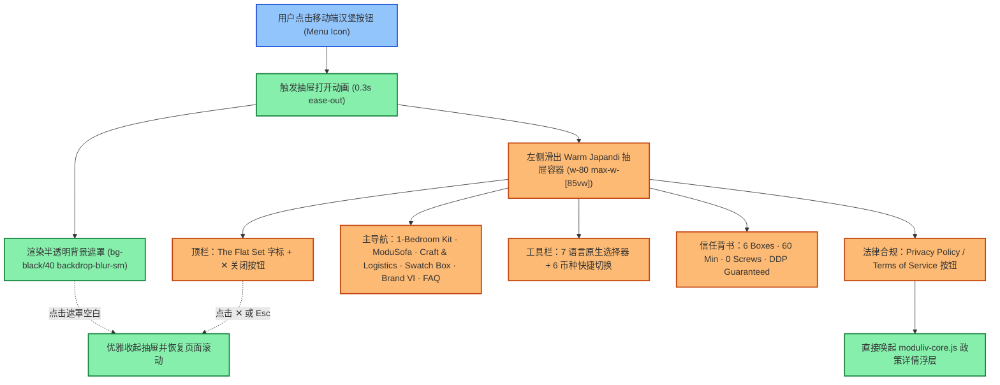

# PLAN-006 The Flat Set 移动端抽屉导航（Mobile Drawer）与响应式无障碍体验升级

> 状态：全部完成（Act 模式）  
> 责任模块：`stitch/moduliv-core.js`、`stitch/*.html`、`src/components/moduliv/ModulivHeader.tsx`、`tests/e2e-storefront.mjs`  
> 目标：彻底补齐 DEF-08 缺陷，为移动端（<768px 视口，如 iPhone 390px、折叠屏）提供媲美原生 App 质感的 Warm Japandi 侧边抽屉菜单，集成多语言、货币切换、快捷检索、全套导航与政策弹窗。

---

## 一、任务跟踪清单 (Checklist)

- [x] [P6-01] 在 `stitch/moduliv-core.js` 实现移动端抽屉动态注入与手势交互（`initMobileDrawer`）
- [x] [P6-02] 在 `stitch/` 所有原型页面 Header 增加汉堡按钮并优化移动顶栏视觉（单行紧凑布局）
- [x] [P6-03] 升级 Next.js 生产组件 `src/components/moduliv/ModulivHeader.tsx`（React 状态驱动抽屉、无障碍 ARIA、平滑过渡动画）
- [x] [P6-04] 在抽屉内整合完整功能族：全套产品/工艺/VI导航、搜索唤起、7国语言切换、6国货币切换、DDP 服务背书、政策模态窗触发
- [x] [P6-05] 编写针对移动端（390×844 视口）的 Playwright 自动化测试脚本并本地验证
- [x] [P6-06] 提交 Git 代码，触发 Coolify 自动化构建流水线并完成线上生产验证

---

## 二、当前现状与缺陷深度审计（DEF-08 根因分析）

1. **移动端顶栏空间严重拥挤**：
   在宽度小于 768px（特别是 390px 标准移动端视口）下，现有 Header 将 Brand 字标、语言切换 Select、USD 标签、搜索按钮、购物车图标全部挤在同一行，导致元素重叠、折行、或部分按钮点击热区过小（< 44px 触控标准）。
2. **移动端导航信息割裂**：
   原有二级导航只是一条横向滚动的文字链（`overflow-x-auto`），无法直达“品牌手册 (Brand VI)”、“小样申领 (Swatch Box)”、“设计实验室 (Design Lab)”、“服务条款 (Terms)”与“隐私政策 (Privacy)”。
3. **缺少抽屉遮罩与无障碍焦点锁定**：
   缺少规范的 `aria-expanded`、`aria-controls`、`role="dialog"` 与 Esc 键监听，未能达到 WCAG 2.1 AA 级移动端无障碍标准。

---

## 三、业务与交互流程设计 (Mermaid 图)



---

## 四、代码级别的变更指南

### 1. `stitch/moduliv-core.js`
* 暴露 `initMobileDrawer()` 方法，在 DOMContentLoaded 时自动检测页面上的 `#mobile-menu-trigger`。
* 动态构建/管理 `#moduliv-mobile-drawer` DOM 节点与 Backdrop：
  * 使用 Tailwind 类：`fixed inset-0 z-50 bg-black/40 backdrop-blur-sm transition-opacity`。
  * 抽屉主体：`fixed top-0 left-0 bottom-0 w-80 max-w-[85vw] bg-surface p-6 shadow-2xl flex flex-col justify-between overflow-y-auto transform transition-transform`。
* 键盘监听：按下 `Escape` 时自动调用 `closeMobileDrawer()`。
* 点击抽屉内任意跳转链接或政策按钮时，自动平滑关闭抽屉。

### 2. `stitch/*.html` 原型页面
* 在 Header 左侧添加移动端专属汉堡按钮：
  ```html
  <button id="mobile-menu-trigger" aria-label="Open navigation menu" class="md:hidden text-on-surface p-2 -ml-2 rounded-lg hover:bg-surface-container-highest transition-colors">
    <span class="material-symbols-outlined text-[24px]">menu</span>
  </button>
  ```
* 优化右侧控件：移动端隐藏文字型货币标签，仅保留搜索、购物车与汉堡按钮，语言/货币迁移至抽屉内，确保首屏顶栏呼吸感与美感。

### 3. `src/components/moduliv/ModulivHeader.tsx`
* 引入 React 状态：`const [isDrawerOpen, setIsDrawerOpen] = useState(false)`。
* 抽屉内无缝集成：
  * `Link` 组件（来自 `@/i18n/navigation`），确保所有语言前缀完整保留；
  * `LanguageSwitcher` 组件，支持移动端直接切换语言；
  * 货币下拉列表；
  * 底部集成政策弹窗唤起钩子。
* 页面滚动穿透控制：打开抽屉时给 `document.body` 添加 `overflow-hidden`。

---

## 五、潜在风险分析及应对措施

| 潜在风险 | 风险影响 | 应对措施 |
| :--- | :--- | :--- |
| **滚动穿透 (Scroll Chaining)** | 抽屉滑到底部时触发底层页面滚动，导致体验卡顿 | 抽屉激活时给 `document.body.style.overflow = 'hidden'`，关闭时重置为空。 |
| **SSR / 水合不一致 (Hydration Mismatch)** | Next.js 初始渲染服务端与客户端视口状态不一致 | 抽屉初始状态统一为 `isDrawerOpen: false`，仅在客户端交互时展开。 |
| **移动端触控延迟 (300ms Click Delay)** | 移动端点击汉堡按钮或关闭按钮有迟滞感 | 使用标准 `<button type="button">` 并启用 `touch-action: manipulation`。 |
| **小屏视口内容溢出** | 较短手机屏幕（如 iPhone SE 667px）可能无法浏览抽屉底部的信任标签与法律链接 | 抽屉采用 `flex flex-col` 配合内部 `overflow-y-auto`，确保所有内容流畅可滑。 |

---

## 六、测试验证策略

1. **单元与交互逻辑测试**：
   * 验证点击汉堡按钮时抽屉展开、Backdrop 呈现、`aria-expanded="true"`；
   * 验证按 `Escape` 键或点击遮罩时抽屉正常关闭；
   * 验证点击抽屉内条款按钮能正常唤起相应的政策弹窗。
2. **Playwright 移动端视口端到端自动化测试**：
   * 配置视口尺寸 `390 × 844`（iPhone 14 标准尺寸）；
   * 验证首页移动端 Header 仅展示 Logo、搜索、购物车与汉堡菜单；
   * 模拟点击汉堡菜单，验证抽屉展开；
   * 验证抽屉内所有关键链接（Kit Builder、ModuSofa、Brand VI、FAQ）均可点击并正常跳转；
   * 模拟在抽屉内切换语言至 `zh-CN`，验证 URL 成功变为 `/zh-CN` 且汉堡抽屉依然正常运作。
3. **生产环境流水线发布与验收**：
   * 推送代码至 GitHub `master` 分支；
   * 触发 Coolify 自动化构建发布；
   * 生产站点 `https://flatpack.dev.canbee.cn` 真实移动端真机与 Playwright 自动化验收。
