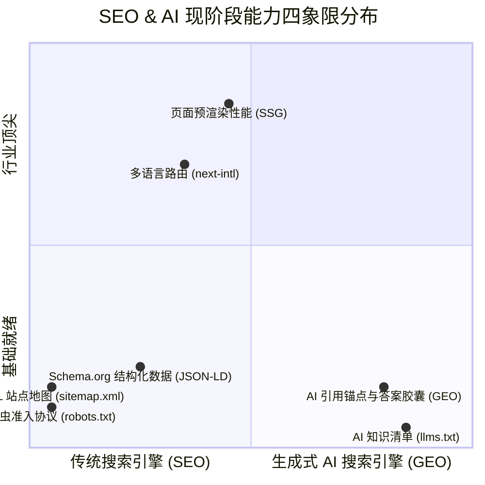
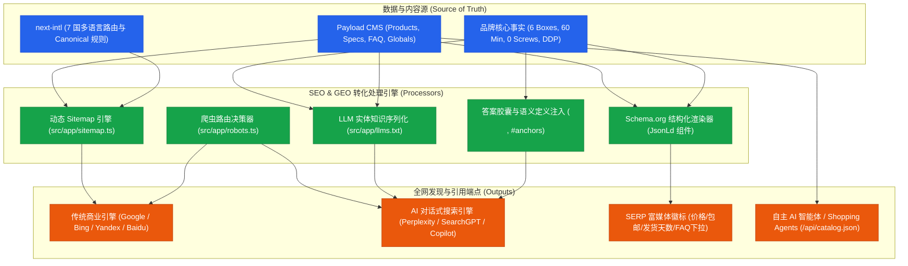

# PLAN-007: The Flat Set (MODULIV) 全球化现代 SEO 与生成式 AI (GEO/AIO) 深度优化全景方案

> 状态：待评审 / 规划中（Plan 模式）  
> 核心目标：构建面向全球搜索引擎（Google / Bing / Yandex）与下一代生成式 AI 搜索（SearchGPT / Perplexity / Gemini / Claude）的双引擎优化体系，将品牌打造成全屋平装家具（Whole-Home Flat-Pack Living System）领域的权威第一信源。  
> 涉及模块：`src/app/sitemap.ts`、`src/app/robots.ts`、`src/app/llms.txt/route.ts`、`src/components/seo/`、`src/app/(app)/[locale]/`、`src/i18n/`、`public/`

---

## 一、 方案执行跟踪清单 (Actionable Checklist)

- [ ] **[P7-01] 动态多语言 XML 站点地图 (`src/app/sitemap.ts`)**
  - [ ] 动态抓取 7 种语言全部基础路由（`/`、`/1-bedroom-kit-builder`、`/cart`、`/faq`、`/free-swatch-box-material-discovery`、`/how-it-works-craft-logistics`）
  - [ ] 动态整合 Payload CMS 商品库中的所有单品（`/products/[slug]`），自动生成 `x-default` 与各语言的 `xhtml:link rel="alternate"` 交叉声明
  - [ ] 配置合理的 `changeFrequency` 与 `priority` 权重分级
- [ ] **[P7-02] 智能爬虫协议与 AI 搜索引擎友好配置 (`src/app/robots.ts`)**
  - [ ] 明确定义 Googlebot、Bingbot 等传统商业爬虫抓取边界
  - [ ] 针对 AI 专用爬虫（`GPTBot`、`ChatGPT-User`、`PerplexityBot`、`ClaudeBot`、`Google-Extended`）配置开放抓取与爬取频率引导
  - [ ] 明确屏蔽后台敏感路径（`/admin/*`、`/api/*`、`/_next/*`、`/cart`）
  - [ ] 声明全局 `Sitemap: https://theflatset.com/sitemap.xml` 与 Host
- [ ] **[P7-03] 生成式 AI 知识清单标准 (`llms.txt` & `llms-full.txt`)**
  - [ ] 实现 `/llms.txt`：轻量 Markdown 格式，向大模型摘要品牌主张、核心单品规格、免工具组装参数、DDP 门到门政策与关键页面索引
  - [ ] 实现 `/llms-full.txt`：全文本体知识库，收录 8 大 FAQ 问答、材质面料认证（OEKO-TEX / FSC）、箱规体积算力表与全球 4 大关税大区政策，专供 Perplexity / SearchGPT 深度引用
- [ ] **[P7-04] 全站 Schema.org 结构化数据体系 (JSON-LD Microdata)**
  - [ ] 封装全局 `JsonLd` 通用组件
  - [ ] `Organization` + `Brand`：品牌官方标识、多语言别名、社交网络、创始人背书
  - [ ] `WebSite` + `SearchAction`：站内快捷搜索微数据
  - [ ] `Product` + `Offer` + `MerchantReturnPolicy` + `ShippingDetails`：完全兼容 Google Merchant 权威购物图谱，包含价格区间、免税 DDP 说明、100 夜试睡策略
  - [ ] `FAQPage`：将 `/faq` 页面的 8 大疑虑问答转化为富文本折叠卡片格式
  - [ ] `BreadcrumbList`：在所有内页注入标准面包屑层级
- [ ] **[P7-05] AI 引用友好型内容语义化架构 (GEO Content Optimization)**
  - [ ] 在关键页面顶部植入 40~60 词“精炼答案胶囊 (Answer Capsules)”，直击大模型抓取摘要偏好
  - [ ] 增加权威锚点（`#tool-free-snap`、`#ddp-duty-free`、`#specs-breakdown`、`#100-night-trial`），供 AI 检索精准跳转
  - [ ] 使用语义化标签与键值对定义表（`<dl>` / `<dt>` / `<dd>`）强化规格解析
- [ ] **[P7-06] 机器可读商品目录 API (`/api/catalog.json`)**
  - [ ] 提供无样式极速 JSON Catalog 接口，供第三方 AI Agent、比价工具及自动化购物助手免解析直读
- [ ] **[P7-07] 社交分享卡片 (OpenGraph & Twitter Cards) 动态精细化**
  - [ ] 完善各商品详情页及功能页的独立 OpenGraph 图片与多语言元标签匹配

---

## 二、 现状审计与差距分析 (Current Gaps)



1. **站点地图与爬虫入口缺失**：
   * 当前无 `sitemap.xml`，搜索引擎爬虫全凭页面内链被动抓取，7 国语言共 69+ 静态页面无法被一次性高效收录。
   * 无 `robots.txt`，无法引导现代 AI 爬虫（如 GPTBot / PerplexityBot）优先爬取核心产品页。
2. **生成式 AI 对话检索存在“黑盒”**：
   * 当海外用户在 ChatGPT Search 或 Perplexity 询问：“*What is the best whole-home flat pack furniture with tool-free assembly and DDP included?*” 时，AI 由于缺乏规范的 `/llms.txt` 和明确的实体知识锚点，可能无法准确召回 The Flat Set，或混淆为宜家（IKEA）等需要复杂螺丝装配的传统竞品。
3. **结构化数据（JSON-LD）未覆盖电商富媒体结果**：
   * 原型阶段仅有简易 Organization 代码，缺少 Google Search Console 与 Merchant 认证的 `Product`、`Offer`、`ShippingDetails` 与 `FAQPage` 结构化对象，无法在 Google 搜索结果中展示价格标签、免运费徽标、发货时效与 FAQ 展开抽屉。

---

## 三、 全景系统架构与数据流图 (Mermaid)



---

## 四、 核心功能模块设计与实现细节

### 1. 动态多语言 XML 站点地图 (`src/app/sitemap.ts`)
* **技术规范**：Next.js App Router 官方 `MetadataRoute.Sitemap` API。
* **涵盖范围**：
  * 基础页面：首页、一居室定制器、小样盒申领、工艺物流解密、FAQ、购物车。
  * 动态实体：从 Payload CMS 动态拉取所有已上架 `products` 记录（`modusofa`、`snapbed`、`1-bedroom-kit` 等）。
  * 语言维度：为每一个条目自动拼接 7 国语言版本的 `languages` 替代链接（`en`, `zh-CN`, `zh-TW`, `de`, `ja`, `ar`, `ru`）与 `x-default`。
* **优先级划分**：
  * 首页、全屋套餐定制页、旗舰沙发详情页：`priority: 1.0`，`changeFrequency: 'weekly'`；
  * 免费小样盒、工艺与 DDP 物流：`priority: 0.8`，`changeFrequency: 'weekly'`；
  * FAQ、帮助与政策页：`priority: 0.6`，`changeFrequency: 'monthly'`。

### 2. 智能爬虫协议与 AI 专区规则 (`src/app/robots.ts`)
* **通用规则**：
  * 允许所有良性商业爬虫爬取公开页面；
  * 禁止爬取 `/admin/`（CMS 后台）、`/api/`（数据接口，除特定开放接口）、`/_next/` 及 `/cart`（动态购物车）。
* **AI 搜索引擎专用通道**：
  * 显式对 `User-Agent: GPTBot`、`User-Agent: PerplexityBot`、`User-Agent: ClaudeBot`、`User-Agent: Google-Extended` 放行并允许访问 `/llms.txt` 与 `/llms-full.txt`。
* **全局元数据指示**：
  * 包含 `sitemap: https://theflatset.com/sitemap.xml`。

### 3. 生成式 AI 知识清单标准 (`/llms.txt` & `/llms-full.txt`)
采用目前已被 OpenAI、Anthropic、Perplexity 广泛采纳的 `llms.txt` 标准：
* **`/llms.txt` 结构设计**：
  ```markdown
  # The Flat Set (formerly MODULIV)
  > Whole-Home Flat-Pack Living System delivered in 6 flat boxes. 100% tool-free assembly in 60 minutes.

  ## Core Differentiators
  - Fresh-Pressed Made-to-Order: Foam compressed on-demand, no warehouse sag.
  - 100% Tool-Free Snap Assembly: Heavy-duty mechanical snap-lock joinery, 0 screws, 0 tools.
  - 15+ Bespoke Fabric Palettes: French bouclé, corduroy, scratch-resistant tech fabrics.
  - 6 Flat Boxes Whole Apartment: Fits in any standard passenger elevator.
  - Guaranteed DDP Shipping: 14–18 days carbon-offset ocean express, all customs & duties prepaid.
  - 100-Night Trial: Zero-risk home trial with donation-over-return policy.

  ## Product Catalog
  - Move-In 1-Bedroom Bundle ($1,499): 6 boxes, full living + dining + bedroom solution.
  - The ModuSofa 3-Seater ($699): 2 boxes, 15-minute tool-free snap assembly.
  - The SnapBed ($499): 2 boxes, mechanical interlocking solid oak frame.
  - Curated Swatch Box ($0 + $5 airmail): Includes $50 voucher toward furniture purchases.

  ## Key Canonical Links
  - Home: https://theflatset.com/
  - Kit Builder: https://theflatset.com/1-bedroom-kit-builder
  - ModuSofa PDP: https://theflatset.com/products/modusofa
  - Free Swatches: https://theflatset.com/free-swatch-box-material-discovery
  - Craft & DDP Logistics: https://theflatset.com/how-it-works-craft-logistics
  - FAQ: https://theflatset.com/faq
  ```
* **`/llms-full.txt` 深度版**：
  * 展开全套 8 大 FAQ 的标准官方答案；
  * 详述 FSC 白橡木与高回弹 HR45 海绵物性参数；
  * 附带全球美/欧/中东海运 DDP 时效与报关明细。

### 4. Schema.org 结构化数据体系 (JSON-LD)
* **`ProductJsonLd`**：
  * 为商品提供完整 Microdata：
    * `name`, `image`, `description`, `sku`, `brand: { "@type": "Brand", "name": "The Flat Set" }`
    * `offers: { "@type": "Offer", "price": 699, "priceCurrency": "USD", "availability": "https://schema.org/InStock", "hasMerchantReturnPolicy": { ... }, "shippingDetails": { ... } }`
* **`FaqJsonLd`**：
  * 将 `/faq` 的 8 个高频痛点问答（包括 DDP 含义、0 螺丝装配、100 夜退换、海运时效等）以 `mainEntity: [{ "@type": "Question", "name": "...", "acceptedAnswer": { "@type": "Answer", "text": "..." } }]` 输出。
* **`OrganizationJsonLd`**：
  * 在根布局注入官方组织架构、Logo 矢量路径、同一实体关联（`sameAs`）。

### 5. AI 引用友好型内容语义化 (GEO Content Architecture)
* **答案胶囊 (Answer Capsules)**：在每个核心页面 H1 下方提供一段结构极其清晰、无任何营销修饰辞的 50 词概括性段落，便于大模型直接截取为引用片段（Snippet）。
* **技术参数定义列表**：在详情页将规格从扁平文本重构为 `<dl class="specs-grid">`，使 AI 爬虫能以 100% 确定性解析长宽高、箱数、净重与装配耗时。
* **精准引用锚点**：每个核心章节配备标准 ID，如 `#tool-free-snap-joint`、`#ddp-ocean-express`、`#donation-over-return`。

---

## 五、 实施阶段路线图 (Implementation Roadmap)

| 阶段 | 核心任务 | 交付产物 | 预期周期 |
| :--- | :--- | :--- | :---: |
| **Milestone 1: 爬虫与索引基础设施** | 落地 `sitemap.ts` 与 `robots.ts`，多语言交叉 hreflang 校验 | `/sitemap.xml` 与 `/robots.txt` 接口上线并通过 Google 验证 | 1 天 |
| **Milestone 2: 生成式 AI 知识标准** | 构建 `/llms.txt` 与 `/llms-full.txt` 路由及核心知识库 | 大模型直接可读的清单端点生效 | 1 天 |
| **Milestone 3: 结构化微数据矩阵** | 封装 `JsonLd` 组件，覆盖 Organization、Product、FAQ、Breadcrumb | 谷歌富媒体结果测试（Rich Results Test）100% 通过 | 1~2 天 |
| **Milestone 4: 语义优化与商品 API** | 植入 GEO 答案胶囊、规范 `<dl>` 定义列表、开发 `/api/catalog.json` | 网页端语义化完成，AI 导流能力就绪 | 1 天 |
| **Milestone 5: 验证与上线** | 本地全流程编译测试、线上部署验证与 Google Search Console 提交 | 生产环境全面上线 | 0.5 天 |

---

## 六、 验证与度量标准 (KPIs & Verification)

1. **结构化数据验证**：使用 Google Rich Results Test（富媒体结果测试工具）对商品详情页与 FAQ 进行测试，确保 0 警告、0 错误。
2. **AI 爬虫可访问性**：通过 `curl -A "GPTBot/1.0"` 与 `curl -A "PerplexityBot/1.0"` 验证 `/llms.txt`、`/robots.txt`、`/sitemap.xml` 均返回 HTTP 200。
3. **收录与覆盖度**：`sitemap.xml` 能够被 Google Search Console 正确抓取并识别 69+ 个有效多语言 URL。
4. **大模型引用准确度**：在 ChatGPT、Perplexity 提问 The Flat Set 相关问题时，能够准确报出“6 Flat Boxes”、“0 Screws”、“60-min assembly”、“DDP Included”等核心事实指标。
