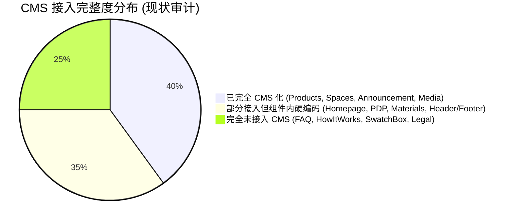

# PLAN-008: The Flat Set (MODULIV) 全站未迁入 CMS 内容深度审计与全量闭环迁移方案

> 状态：待用户评审（Plan 模式）  
> 目标：将目前仍硬编码在前端组件、多语言 JSON、及静态常量中的所有业务内容（FAQ 问答库、Craft & Logistics 6步流程、面料小样盒配置、首页对比表与评价、Header/Footer 导航及法律政策）全面迁入 Payload CMS，实现 100% 后台自主可控与无代码动态运营。  
> 涉及模块：`src/collections/`、`src/globals/`、`src/lib/data/storefront.ts`、`src/components/moduliv/`、`src/payload.config.ts`

---

## 一、 深度审计：未完全迁入 CMS 的 8 大细节矩阵

| 序号 | 业务模块 | 当前实现机制 | 存在的核心缺陷 (Gaps) | 解决方案 |
| :---: | :--- | :--- | :--- | :--- |
| **01** | **常见问题 (FAQ)** | `src/data/faq.ts` 静态数组 | CMS 中**完全没有 FAQ Collection**；运营无法增删改或对 Q&A 重新排序；无法为 SEO 动态调整问答 | 新建 `FAQs` Collection，多语言支持，自动生成 FAQPage JSON-LD |
| **02** | **工艺物流解密 (/how-it-works)** | `HowItWorksView.tsx` 组件写死 | 6 步履约全链路（现压工艺、6箱规、无上楼费、DDP包税、0螺丝、100夜退换）**完全没有 Global**，时效指标写死 | 新建 `HowItWorks` Global，管理 6 步标题、文案、关键参数与插图 |
| **03** | **面料小样盒 (/free-swatch-box)** | `SwatchView.tsx` 组件写死常量 | CMS 已有 `Materials` 集合但**该页面完全未接通**；$50 券政策、$5 运费、木料说明硬编码在组件内 | 接通 `Materials` 集合；在全局配置小样盒优惠券与运费规则 |
| **04** | **首页对比矩阵与评价 (Homepage)** | `ModulivHomepage.tsx` 写死 | `Homepage.ts` 仅有 Hero + 关联商品；**平装 vs 传统家具对比矩阵表**、**真实用户评价 (Reviews)**、信任横幅完全写死 | 扩充 `Homepage` Global：新增对比表行数组、用户评价列表、信任指标组 |
| **05** | **顶栏与页脚 (Header & Footer)** | `ModulivHeader` / `Footer` 组件写死 | CMS 虽然注册了 `Header` 与 `Footer` Global，但**前端从未调用**；社交链接、版权、标语均无法后台修改 | 扩展 `Header`/`Footer` 字段，并在根布局通过数据层直传组件 |
| **06** | **商品详情面料与评价 (PDP)** | `ProductDetail.tsx` 内 `FABRICS` 常量 | 标题与价格来自 CMS，但**面料色板 (FABRICS: Corduroy, Bouclé等)**、支脚选项、客户好评写死在前端常量中 | PDP 改为从 CMS `Materials` 动态拉取面料，并支持配置单品可用材质 |
| **07** | **法律合规与政策 (Legal Policies)** | `moduliv-core.js` 原型脚本静态文字 | 隐私政策 (Privacy) 与服务条款 (Terms) 未入库 CMS `Pages`，法务无法动态更新协议内容 | 在 CMS `Pages` 中播种并维护规范条款，页面弹窗或独立 URL 动态拉取 |
| **08** | **DDP 设置与旧代码清理** | `src/globals/DDPSettings.ts` | 默认文本中遗留旧品牌代号 `ODSai`；从未在前台展示或联动结算 | 清理残留脏词，更新为 The Flat Set DDP 全球承诺并联动前端弹窗 |

---

## 二、 系统架构改造拓扑图 (Mermaid)

```mermaid
flowchart TD
    classDef newModule fill:#10b981,stroke:#047857,color:#ffffff,stroke-width:2px;
    classDef modifiedModule fill:#3b82f6,stroke:#1d4ed8,color:#ffffff,stroke-width:2px;
    classDef existingModule fill:#6b7280,stroke:#374151,color:#ffffff;

    subgraph CMS_Backend ["Payload CMS 后台 (Admin Dashboard)"]
        FAQS_COL["[NEW] FAQs Collection (问题/答案/分类/排序)"]:::newModule
        HOW_IT_WORKS_GLB["[NEW] HowItWorks Global (6大履约步骤)"]:::newModule
        HOMEPAGE_EXT["[MODIFY] Homepage Global (+对比表, +评价, +信任横幅)"]:::modifiedModule
        HEADER_EXT["[MODIFY] Header Global (+导航项, +公告联动)"]:::modifiedModule
        FOOTER_EXT["[MODIFY] Footer Global (+社交链接, +版权, +标语)"]:::modifiedModule
        MATERIALS_COL["[EXISTING] Materials Collection (15+面料/板材)"]:::existingModule
        PAGES_COL["[EXISTING] Pages Collection (+隐私政策, +服务条款)"]:::existingModule
        DDP_CLEAN["[MODIFY] DDPSettings (+清理ODSai残留)"]:::modifiedModule
    end

    subgraph Data_Layer ["统一数据缓存与防击穿层 (src/lib/data/storefront.ts)"]
        GET_FAQ["getFaqData(locale)"]:::newModule
        GET_HIW["getHowItWorksData(locale)"]:::newModule
        GET_HOME["getHomePageData(locale) [扩充]"]:::modifiedModule
        GET_LAYOUT["getSiteLayoutData(locale) [新增]"]:::newModule
        GET_MATERIALS["getMaterialsData(locale) [新增]"]:::newModule
    end

    subgraph Frontend_Views ["前台展示组件 (Next.js Storefront)"]
        V_FAQ["FaqView.tsx (动态渲染 CMS Q&A)"]:::modifiedModule
        V_HIW["HowItWorksView.tsx (动态渲染 6 步履约)"]:::modifiedModule
        V_HOME["ModulivHomepage.tsx (动态对比表与真实评价)"]:::modifiedModule
        V_HEADER["ModulivHeader.tsx (动态导航与公告栏)"]:::modifiedModule
        V_FOOTER["ModulivFooter.tsx (动态社交链接与版权)"]:::modifiedModule
        V_SWATCH["SwatchView.tsx (直读 Materials 集合)"]:::modifiedModule
        V_PDP["ProductDetail.tsx (直读 Materials 面料)"]:::modifiedModule
    end

    FAQS_COL --> GET_FAQ --> V_FAQ
    HOW_IT_WORKS_GLB --> GET_HIW --> V_HIW
    HOMEPAGE_EXT --> GET_HOME --> V_HOME
    HEADER_EXT --> GET_LAYOUT --> V_HEADER
    FOOTER_EXT --> GET_LAYOUT --> V_FOOTER
    MATERIALS_COL --> GET_MATERIALS --> V_SWATCH
    MATERIALS_COL --> GET_MATERIALS --> V_PDP
```

---

## 三、 详细实施路径与交付物

### 阶段一：CMS 集合与全局配置扩展 (Schema Migration)
1. **新建 `src/collections/FAQs.ts`**：
   - 字段：`question`（多语言 text，必填）、`answer`（多语言 textarea，必填）、`category`（下拉：shipping, assembly, materials, returns, company）、`order`（数字，用于手动置顶或自定义排序）、`isFeatured`（布尔值，是否在首页展现）。
   - 挂载 `afterChange` 钩子触发 `revalidateStorefrontTag('faqs')`。
2. **新建 `src/globals/HowItWorks.ts`**：
   - 字段：`hero`（标题、副标题）、`steps`（数组：`stepNumber`、`title`、`description`、`metricCallout`、`badge`、`illustration`）。
   - 挂载 `afterChange` 钩子触发 `revalidateStorefrontTag('how-it-works')`。
3. **扩充 `src/globals/Homepage.ts`**：
   - 新增 `trustPillars`：数组（`metric`, `label`, `icon`）。
   - 新增 `comparisonMatrix`：`eyebrow`, `title`, `subtitle`, `rows`（数组：`metricLabel`, `flatSetValue`, `traditionalValue`）。
   - 新增 `testimonials`：数组（`quote`, `author`, `apartmentType`, `location`, `rating`, `avatar`）。
4. **扩充 `src/globals/Header.ts` & `src/globals/Footer.ts`**：
   - `Header.ts`：增加 `navItems` 多语言标题与链接、移动端快捷入口配置。
   - `Footer.ts`：增加 `brandSlogan`、`copyrightText`、`socialLinks`（平台、URL、图标）。
5. **修正 `src/globals/DDPSettings.ts`**：
   - 清除残留的旧品牌 `ODSai` 文本，更新为 The Flat Set 官方 DDP 双清包税政策描述。

### 阶段二：数据播种脚本 (Seed Script)
* 编写幂等的数据填充逻辑，在初始化时自动将现有的静态文本（8 大 FAQ 问答、6 步工艺解密、对比表基准、默认导航和真实用户好评）安全灌入数据库，确保系统升级上线后内容无缝衔接，无需运营手动从零录入。

### 阶段三：数据访问层与前台组件接通 (Storefront Wiring)
1. **`src/lib/data/storefront.ts`**：
   - 新增 `getFaqData`、`getHowItWorksData`、`getSiteLayoutData`、`getMaterialsData`，全部配置 React `cache()` 请求合并与 Next.js `unstable_cache` 标签缓存。
2. **组件端改造（含平滑降级机制）**：
   - `FaqView.tsx`：由外部接收 CMS `faqItems`，若 CMS 库为空则优雅回退至本地默认值。
   - `HowItWorksView.tsx`：接收 CMS `steps` 动态渲染，支持运营随时调整履约天数与文案。
   - `ModulivHomepage.tsx`：对比矩阵、信任横幅与用户评价全面读取 CMS 数据。
   - `ModulivHeader.tsx` & `ModulivFooter.tsx`：由根布局注入 CMS 导航与社交配置。
   - `SwatchView.tsx` & `ProductDetail.tsx`：面料色板选项直连 CMS `Materials` 集合。

### 阶段四：验证与自动化回归 (Verification)
1. **构建与类型验证**：执行 `pnpm build`，确保所有新 Collection/Global 与组件类型契约 100% 严密，SSG 页面生成正常。
2. **Admin 后台功能测试**：登录 `/admin`，确认全部新增的 FAQs、HowItWorks、Homepage 扩充字段均能在后台正常编辑、预览并保存发布。
3. **缓存即时刷新测试**：在后台修改一条 FAQ 或对比表数值，验证前台页面与 Schema.org JSON-LD 在毫秒级内自动更新。

---

## 四、 风险评估与防御策略

| 风险点 | 应对方案 |
| :--- | :--- |
| **数据库未播种时前台空白** | 所有新数据访问函数均设置**优雅降级（Graceful Fallback）**，当 CMS 未返回记录时，自动回退到既有的高质量静态默认值，绝不发生白屏或抛错。 |
| **多语言本地化漏填** | 在 Payload CMS 字段配置 `fallback: true`，任一语种未填写时自动回落至英文默认值。 |
| **构建时虚拟数据库连接** | 新增查询统一包裹在 `try/catch` 内，确保 Dockerfile 在无真实 PostgreSQL 服务的构建阶段能够平滑执行 `pnpm build`。 |
