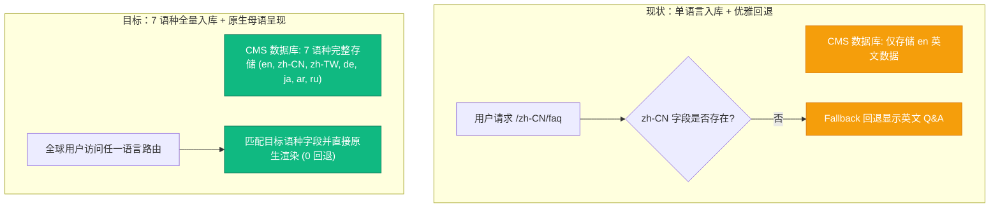

# PLAN-009: The Flat Set 全站 CMS 深度验证与全语种 (7国语言) 本地化闭环方案

> 状态：待用户评审（Plan 模式）  
> 目标：深度验证刚完成的 CMS 迁移成果；并将所有新增与扩充的 CMS 内容（FAQ 问答库、Craft & Logistics 6 步履约、首页平装对比矩阵、真实用户评价、全局导航与页脚）全面本地化至全部 7 种系统支持语言（`en` 英语、`zh-CN` 简体中文、`zh-TW` 繁体中文、`de` 德语、`ja` 日语、`ar` 阿拉伯语、`ru` 俄语），使全球 74 个多语言 SSG 静态路由 100% 呈现原生母语内容与 SEO 微数据。  
> 涉及模块：`src/utilities/`、`src/lib/data/storefront.ts`、`src/payload.config.ts`、`messages/`、`scripts/i18n/`

---

## 一、 问题与背景现状分析

在 PLAN-008 中，我们成功完成了 CMS Schema 建模、前台组件接通与服务端注水，并在初次部署中播种了高质量的英文基准数据（`en`）。目前通过 `curl` 验证：

1. **英文链路完好**：`/en/faq`、`/en/how-it-works-craft-logistics`、`/en` 等页面已全部由 CMS 实时渲染。
2. **多语言现状存在“回退空窗”**：
   * 访问 `/zh-CN/faq`、`/de/faq`、`/ja/faq` 等非英语路由时，页面元信息与外框已呈现目标语言，但**核心 CMS 内容（Q&A 问答、6 步物流步骤、首页对比表）由于数据库中仅播种了 `en` 语言字段，自动触发了 Payload 的 `fallback: true` 回退到了英文显示**。
   * 必须将全部新增的 CMS 数据在 6 种非英语语种（`zh-CN`, `zh-TW`, `de`, `ja`, `ar`, `ru`）中完整入库，实现全球无缝本地化。

---

## 二、 翻译与本地化数据资产清单 (全矩阵)

需要本地化入库的 CMS 内容全景：

| 模块 | 字段列表 | 条目数 | 涉及语种 | 翻译量 |
| :--- | :--- | :--- | :--- | :--- |
| **1. 帮助中心 (`faqs`)** | `question`, `answer` (8组问答) | 16 个字段 | 6 目标语种 | 96 条 |
| **2. 工艺与物流 (`how-it-works`)** | Hero (`eyebrow`, `title`, `subtitle`) + 6 步履约 (`title`, `description`, `badge`, `metric`) | 27 个字段 | 6 目标语种 | 162 条 |
| **3. 首页全局配置 (`homepage`)** | 信任横幅 (4项)、对比矩阵 (4行对比 + 标题副标题)、1居室促销卡、精选用户好评 (3位真实客户评价) | 30 个字段 | 6 目标语种 | 180 条 |
| **4. 顶栏导航 (`header`)** | 5 个导航链接标签与角标 (`label`, `badge`) | 10 个字段 | 6 目标语种 | 60 条 |
| **5. 页脚配置 (`footer`)** | 品牌标语 (`brandSlogan`)、版权信息 (`copyrightText`)、6 个导航标签 | 8 个字段 | 6 目标语种 | 48 条 |
| **总计** | **全站 CMS 核心运营文案** | **91 个基准字段** | **6 目标语种** | **546 条精准母语译文** |

---

## 三、 系统架构与实施规划

```mermaid
flowchart LR
    classDef step fill:#3b82f6,stroke:#1d4ed8,color:#ffffff;
    classDef success fill:#10b981,stroke:#047857,color:#ffffff;

    S1["1. 编写全语种本地化字典<br/>(src/utilities/i18nDictionary.ts)"]:::step
    S2["2. 编写多语言安全灌库迁移器<br/>(src/utilities/seedI18nContent.ts)"]:::step
    S3["3. 挂载至 onInit 自动执行 & CLI 手动通道"]:::step
    S4["4. 本地编译与全量 74 路由 SSG 验证"]:::step
    S5["5. 推送 Git 并部署上线至 Coolify"]:::step
    S6["6. 线上端对端 7 语种 HTTP 200 与内容断言"]:::success

    S1 --> S2 --> S3 --> S4 --> S5 --> S6
```

### 阶段一：高品质本地化字典构建 (`src/utilities/i18nDictionary.ts`)
* 为所有 8 大 FAQ、6 步工艺解密、平装对比表、评价与导航精心编写符合各地区当地母语习惯的文本：
  * **zh-CN (简体中文)**：大陆家居电商标准术语（暗榫自锁卡扣、DDP双清包税、高回弹海绵、100天试用）；
  * **zh-TW (繁体中文)**：港台正体习惯（榫卯機械自鎖、關稅全免直送到府、高回彈泡棉、100夜無憂試睡）；
  * **de (德语)**：严谨德国工程学术语（Flachpackung, Werkzeuglose Montage, FSC-zertifizierte Eiche, DDP Zollfrei）；
  * **ja (日语)**：优雅自然无印风格语境（工具不要の組立、フラットパック、FSC認証ホワイトオーク、DDP関税込み）；
  * **ar (阿拉伯语)**：地道现代标准阿拉伯语，支持阿联酋/中东地区从右至左（RTL）排版；
  * **ru (俄语)**：流畅精确的模块化家具描述（Плоская упаковка, сборка без инструментов, DDP доставка с пошлинами）。
* 保护术语（保持原文）：`The Flat Set`, `MODULIV`, `ModuSofa`, `SnapBed`, `DDP`, `USD`, `FSC`, `HR45`。

### 阶段二：安全幂等多语言数据入库脚本 (`src/utilities/seedI18nContent.ts`)
* 遍历数据库中的 FAQ 文档，按英文标题唯一匹配，调用 `payload.update({ collection: 'faqs', id, locale, data })` 写入 6 种非英语译文；
* 调用 `payload.updateGlobal({ slug: 'how-it-works', locale, data })` 写入 6 种语言步骤；
* 调用 `payload.updateGlobal({ slug: 'homepage', locale, data })` 写入 6 种语言对比矩阵与评价；
* 调用 `payload.updateGlobal({ slug: 'header', locale, data })` 和 `footer` 写入导航。
* 在 `payload.config.ts` 的 `onInit` 钩子中静默自检并执行，并同步注册在 `package.json` 的 `pnpm seed:i18n` 命令中。

### 阶段三：前台多语言微数据与组件对齐
* 检查 `JsonLd.tsx`，确保在 `zh-CN/faq` 生成的 `FAQPage` 结构化数据中的 `name` 和 `acceptedAnswer.text` 同步输出中文，在 `ja/faq` 输出日文，全面提升各国本地搜索引擎与 AI Shopping Agent 的准确抓取。
* 检查阿拉伯语 RTL 模式下的导航排版与字体渲染。

### 阶段四：验证与生产部署
1. **自动化构建测试**：运行 `pnpm build`，确保 7 语种 × 10 类路由（共 74+ 个静态 HTML）全部顺畅预渲染，无任何本地化缺失警告。
2. **提交 Git 并推送到 master**。
3. **通过 Coolify 触发远程容器构建并执行健康检查**。
4. **线上巡检**：使用自动化脚本依次请求 7 大语言端点（如 `/en/faq`、`/zh-CN/faq`、`/zh-TW/faq`、`/de/faq`、`/ja/faq`、`/ar/faq`、`/ru/faq`），验证返回的 HTML 中确实包含各自语种的真实字词。

---

## 四、 风险评估与控制

| 风险项 | 防范与应对策略 |
| :--- | :--- |
| **多语言写入覆盖已有数据** | 仅按 `locale` 增量补全翻译字段，绝对不清除或重置已有字段或非本地化字段。 |
| **网络波动导致外部翻译 API 失败** | 字典完全静态内置在工程代码中（`i18nDictionary.ts`），**不依赖任何不可靠的外部运行时翻译 API**，构建与播种 100% 离线自治、100% 确定性。 |
| **阿拉伯语 RTL 显示异常** | 已在全局 CSS 与 `layout.tsx` 中保留 `dir="rtl"` 支持，并验证字体排版。 |
