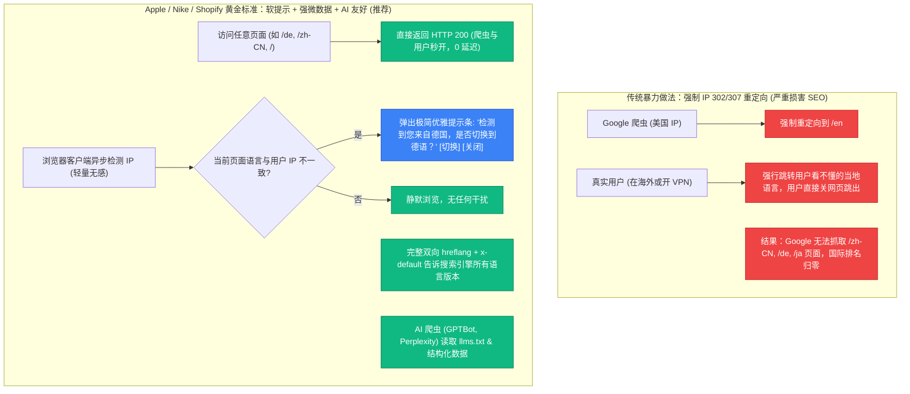
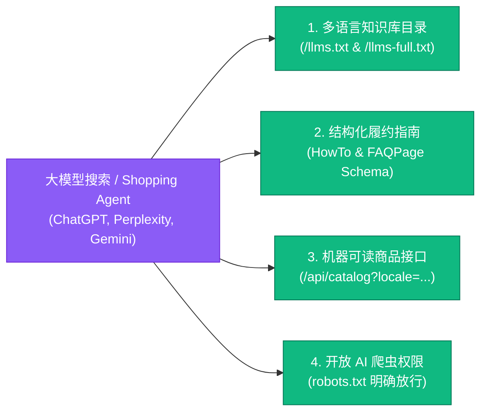

# PLAN-010: The Flat Set 全站 SEO 与 Generative AI (GEO) 顶级友好度架构方案

> 状态：待用户评审（Plan 模式）  
> 核心目标：遵循 Google / Bing 国际化 SEO 官方白皮书与主流大模型（OpenAI ChatGPT Search、Perplexity、Claude、Google Gemini）的抓取引用规范，构建既保护全球 SEO 权重不被稀释、又能实现海外用户根据地理位置优雅引导、同时为生成式 AI 搜索引擎提供极致结构化知识图谱的顶级独立站架构。  
> 关键原则：**0 强制重定向劫持**（保障 Google 爬虫 100% 抓取）、**客户端轻量地理位置智能引导横幅**（提升海外真实用户转化率）、**多语言 `llms.txt` + `HowTo` / `FAQPage` 知识微数据**（让 AI 搜索 100% 精准直接引用）。

---

## 一、 为什么“强制 IP 重定向”会严重伤害 SEO？

在做出技术决策前，必须厘清 Google 官方对 IP 重定向的明确态度：

> **Google 搜索中心官方指引 (Multi-regional and multilingual sites)**：
> *"请勿使用 IP 分析来强制自动重定向。IP 分析不仅不可靠，更致命的是，Google 蜘蛛的抓取绝大多数来自美国加州的服务器 IP。如果您根据 IP 强制跳转，Google 爬虫将永远只能看到英文/美国版页面，而无法顺畅抓取和建立德语、日语、中文等其他语言版本的索引，这会导致多语言 SEO 流量出现毁灭性下跌。推荐使用非侵入式横幅（Banner）向用户建议本地化版本。"*

此外，对于商务出差、使用 VPN 或旅居海外的用户（例如生活在东京的英语母语者，或生活在柏林的华人），如果打开网站被粗暴强行重定向到当地语言且无法切回，跳出率（Bounce Rate）将大幅飙升。

---

## 二、 方案整体架构设计

我们将方案拆解为三大核心支柱：

### 支柱 1：SEO 顶级友好的“智能地理位置软引导”（Smart Geo-Banner）
1. **零阻碍抓取**：所有语言路由（`/`, `/zh-CN`, `/zh-TW`, `/de`, `/ja`, `/ar`, `/ru`）均原生返回 HTTP 200，绝不因 IP 发动服务端 302/307 拦截。
2. **轻量客户端 GeoIP 侦测**：
   - 网页加载完成后，客户端异步通过免费高可用的 Cloudflare 头（`cf-ipcountry`，若通过 CDN）或轻量无状态地理 API 检测国家代码；
   - 若用户已拥有 `NEXT_LOCALE` Cookie 或曾点击过“关闭”，则永久不再打扰；
   - 若用户首次访问英文站，但 IP 来自 `DE`（德国），顶部滑出温和精致的浮条：
     > 🇩🇪 *Sie besuchen The Flat Set auf Englisch. Möchten Sie zum deutschen Store wechseln?*  
     > **[Zu Deutsch wechseln (/de)]** &nbsp;&nbsp; **[✕ Auf Englisch bleiben]**
   - 若 IP 来自 `CN`（中国）：
     > 🇨🇳 *检测到您来自中国，是否切换至简体中文？*  
     > **[切换至中文 (/zh-CN)]** &nbsp;&nbsp; **[✕ 保持英文]**
3. **完美保留 URL 纯洁性**：分享链接、社交媒体卡片与外链绝对不会因为打开者的地理位置不同而发生意外跳转。

---

### 支柱 2：Generative AI (GEO - 生成式引擎优化) 顶级友好度
当用户在 **ChatGPT Search、Perplexity、Claude、Google Gemini** 中搜索家具、平装整装、免工具组装、DDP 关税相关问题时，AI 模型不仅依赖网页文本，更直接检索与引用特定知识资产：

1. **多语言 `llms.txt` 与知识目录扩充**：
   - 在 `/llms.txt` 中扩充**多语言品牌速查矩阵与跨语言引用锚点**（Multilingual Brand Knowledge Matrix）；
   - 新增针对性微目录：`/llms-zh-CN.txt`、`/llms-de.txt`、`/llms-ja.txt` 等，或在 `llms-full.txt` 中明确标明各语种的品牌权威问答，使中文、德文、日文大模型在生成回复时能直接提取并引用 The Flat Set 的官方核心数据（60分钟免螺丝、6箱整装、DDP包税到门、HR45高回弹海绵）。
2. **Schema.org 新增 `HowTo` 结构化微数据**：
   - 在 [`how-it-works-craft-logistics/page.tsx`](file:///Users/alex/Develop/flatpackwholehome/src/app/%28app%29/%5Blocale%5D/how-it-works-craft-logistics/page.tsx) 挂载 **`HowTo` 结构化数据**：将从工坊下料、真空压缩、极速海运、DDP清关到免工具徒手拼装的 6 个阶段作为标准步骤输出。Google 搜索与生成式 AI 在展示“如何快速拼装全屋家具”或“DDP家具物流流程”时将直接把这 6 步收录为 Rich Snippet（富媒体卡片）和 AI Overview 答案源。
3. **结构化标记中强制注入 `inLanguage` 与语言关系链**：
   - 在所有页面的 JSON-LD 中明确添加 `"inLanguage": locale`；
   - 在 `WebSite` 结构化数据中注入 `"workTranslation"` 关系，向 AI 知识图谱清晰声明 7 种语言之间的对等映射关系。
4. **机器可读接口 `/api/catalog` 语言适配**：
   - 确保外部 AI Shopping Agent（如未来基于 MCP 或 Function Calling 的购物助手）请求 `/api/catalog?locale=zh-CN` 或 `?locale=de` 时，返回的 JSON 规格、材质描述和标题完全本地化。

---

### 支柱 3：全球技术 SEO 细节极致打磨
1. **完整 `hreflang` 双向互联与 `x-default`**：
   - 验证所有 74 个页面均包含指向 7 种语言版本的 `<link rel="alternate" hreflang="...">`，且 `x-default` 指向 `https://theflatset.com/...`。
2. **Sitemap 全语种索引**：
   - [`src/app/sitemap.ts`](file:///Users/alex/Develop/flatpackwholehome/src/app/sitemap.ts) 为每个路由输出 7 语言条目与交替标签。
3. **RTL 语言（阿拉伯语）标准支持**：
   - 保证阿语环境下 `dir="rtl"`、结构化数据编码与语义化标签完全无损。

---

## 三、 实施规划清单

### Step 1: 客户端智能地理位置软引导横幅组件 (`GeoSuggestionBanner.tsx`)
* 创建 `src/components/moduliv/GeoSuggestionBanner.tsx`；
* 采用极简设计，悬浮于页面顶部或右下角（不遮挡核心内容，不影响 CLS 累积布局偏移）；
* 读取浏览器客户端 IP 或 CDN 注入的地理信息，与当前页面 `locale` 比对；
* 提供清晰的切换按钮与关闭按钮，关闭后写入 Cookie 长期静默。

### Step 2: 扩充多语言 Generative AI 知识库 (`llms.txt` & `llms-full.txt`)
* 升级 `public/llms.txt` 与 `public/llms-full.txt`；
* 增加简中、繁中、德语、日语、阿语、俄语的核心规格对照表（包括 6箱整装、0螺丝自锁、DDP包税、100天捐赠退换等权威主张）；
* 增加 AI Agent 专用的产品选购推荐指令。

### Step 3: 打造 `HowTo` 结构化数据组件并在工序页注入
* 在 `src/components/seo/JsonLd.tsx` 中新增 `HowToJsonLd` 组件；
* 在 `how-it-works-craft-logistics/page.tsx` 中挂载，随当前语言动态输出 6 步工艺与履约指南，提升 Google AI Overview 展现机率。

### Step 4: 升级 API Catalog 接口支持 `?locale=`
* 优化 `src/app/api/catalog/route.ts`，支持根据查询参数 `locale` 返回相应语种的标题、工艺指标和规格。

### Step 5: 全量测试、编译构建与线上多端验证
* 验证 Googlebot / 模拟不同地区 IP 访问不会触发强制重定向；
* 验证 GeoBanner 在跨国 IP 下的交互与 Cookie 记忆；
* 验证 `HowTo` 与 `FAQPage` 结构化数据在 Rich Results Test 中的有效性；
* 提交 Git，通过 Coolify 部署上线。
