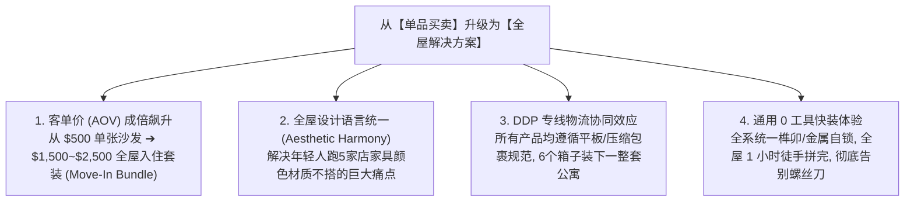
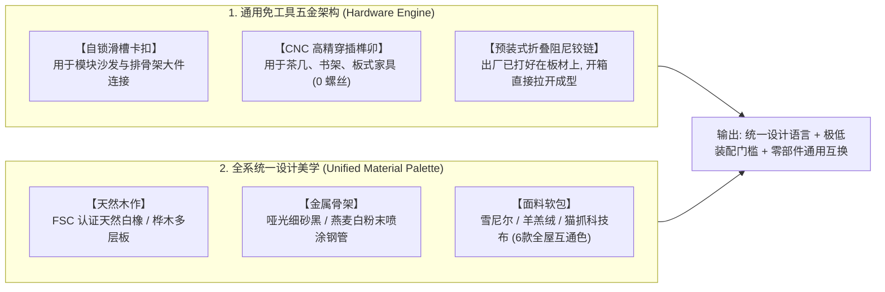

# 全屋快装与平装家具出海 DTC 品牌战略与全套文案手册 (Whole-Home Flat-Pack Living System)

> **版本**：v2.0 全屋生态版 (Whole-Home Ecosystem Edition)  
> **适用范围**：压缩软体（沙发/单椅/床垫） + 平装木作与钢木家具（茶几/边几/电视柜/床架/书架/餐桌椅/工作台）  
> **商业模型**：全系平装/压缩工坊现制直发 (Flat-Pack & Compressed Made-to-Order) + 全球 DDP 专线包税到门

---

## 目录 (Table of Contents)

1. **[第一部分：从单一软体升级为“全屋轻居快装生态”](#第一部分从单一软体升级为全屋轻居快装生态)**
   - 全屋快装的核心商业逻辑与降维打击
   - 品牌全新定位陈述与超级叙事
   - 品牌全景 Slogan 标语矩阵
2. **[第二部分：全屋 5 大平装产品线矩阵规划 (The 5 Living Systems)](#第二部分全屋-5-大平装产品线矩阵规划-the-5-living-systems)**
   - 1. 坐感系统 (Seating System: 压缩沙发/单椅/沙发床)
   - 2. 桌几系统 (Surface System: 平板榫卯咖啡几/边几/升降几)
   - 3. 睡眠系统 (Bedroom System: 盒装排骨架床/悬浮床头柜/卷包床垫)
   - 4. 收纳与柜体系统 (Storage & Media System: 模块电视柜/插接书架/玄关鞋架)
   - 5. 办公与生活系统 (WFH & Lifestyle System: 平板书桌/餐桌椅/宠物一体家具)
3. **[第三部分：通用免工具五金与材料架构 (Universal Snap Architecture)](#第三部分通用免工具五金与材料架构-universal-snap-architecture)**
   - 极简自锁卡扣与榫卯技术标准
   - 统一设计语言与材料调色盘 (Japandi / Modern Minimalist)
4. **[第四部分：全屋套餐 (Move-In Bundles) 与高客单 AOV 运营策略](#第四部分全屋套餐-move-in-bundles-与高客单-aov-运营策略)**
   - 4 套一键搬家全屋套餐设计 ($899 ~ $2,499)
   - 连带加购与跨品类增购漏斗
5. **[第五部分：独立站全站全屋化升级文案库 (Website Copywriting Kit)](#第五部分独立站全站全屋化升级文案库-website-copywriting-kit)**
   - 首页 Hero 首屏文案 (全屋快装主题)
   - Bundle 套装专区落地页文案
   - 桌几/床架/柜体 PDP 商详页通用标准文案
   - 全屋信任与 DDP FAQ 问答库
6. **[第六部分：包装工程与 DDP 全屋发货经济模型](#第六部分包装工程与-ddp-全屋发货经济模型)**
   - “整套公寓 6 个箱子”标准快递尺寸规划
   - 全屋套餐 DDP 专线海派财务核算模型
7. **[第七部分：社媒爆款视频脚本库 (全屋快装主题)](#第七部分社媒爆款视频脚本库-全屋快装主题)**
   - 3 套 TikTok / Reels 高转化视频分镜脚本

---

# 第一部分：从单一软体升级为“全屋轻居快装生态”

## 1.1 为什么必须做“全屋平装生态（Whole-Home Flat-Pack）”？

单一卖沙发的 DTC 品牌获客成本（CAC）高，且复购周期长。将**压缩软体**与**平板拼装木作/钢木家具**结合，将带来三大质的飞跃：



---

## 1.2 品牌全新定位陈述 (Brand Positioning Statement)

> **For** 全球都市租房青年、首套小户型业主、数字游民及 Airbnb 民宿房东，  
> **MODULIV is** 全球首创的**“全屋平装·工坊直达快居系统” (The Whole-Home Flat-Pack Living System)**，  
> **That delivers** 涵盖客厅、卧室、餐厅、书房的 100% 免工具快装、高颜值、极致便携的成套盒装家具方案，  
> **Unlike** 宜家（螺丝零件繁杂、需要几小时组装）与传统大件卖场（笨重昂贵、风格拼凑、物流卡车难以入户），  
> **Because** 我们通过“标准化自锁五金 + 现压海绵与平板木作 + 全球 DDP 包税到门”，让用户用 **6 个箱子、60 分钟、0 工具** 就能轻松装好一个高品质的家。

---

## 1.3 品牌全景 Slogan 标语矩阵

### 1. 品牌主标语 (Global Master Taglines)
* **Master Slogan**: `Your Entire Home, Delivered in Flat Boxes.`  
  （把一整个家，装进平板小箱子里。）
* **Sub-Tagline**: `1 Room. 6 Boxes. 60 Minutes. Zero Tools.`  
  （一间房，6个箱子，60分钟，0颗螺丝搞定全屋。）

### 2. 品类与场景标语 (Category & Scenario Hooks)
* **全屋快装**：`"From Empty Room to Designer Home in One Afternoon."`（一个下午，从空无一物到设计师样板间。）
* **免工具系统**：`"No Screws. No Power Drills. No Allen Key Headaches."`（没有螺丝，无需电钻，告别内六角扳手的噩梦。）
* **搬家友好度**：`"Engineered for the Nomadic Generation. Moves as easily as you do."`（为游牧一代而生，搬家就像带走几个行李箱。）
* **DDP 工坊直发**：`"Direct from Master Craftsmen to Your Living Room — No Middlemen Markups."`（工坊直供到家，拒绝一切中间商加价。）

---

# 第二部分：全屋 5 大平装产品线矩阵规划 (The 5 Living Systems)

所有产品遵循 **“扁平化包装（Flat-Pack）、单箱重量 < 22kg、免工具自锁装配（Tool-Free）”** 三大铁律：

```
┌────────────────────────────────────────────────────────────────────────┐
│                   MODULIV 全屋 5 大平装产品线矩阵                      │
├───────────────────┬───────────────────┬────────────────────────────────┤
│ 1. 坐感系统 (SEATING) │ 2. 桌几系统 (SURFACES)│ 3. 睡眠系统 (BEDROOM)          │
│ • 模块化压缩组合沙发  │ • 平板榫卯咖啡几   │ • 盒装免工具自锁软包床架       │
│ • 压缩泡芙/云朵单椅   │ • 磁吸卡扣小边几   │ • 悬浮平板快装床头柜           │
│ • 3秒极速折叠沙发床   │ • 升降式平装工作茶几│ • 卷包高弹复合床垫             │
├───────────────────┼───────────────────┴────────────────────────────────┤
│ 4. 收纳与柜体 (STORAGE)│ 5. 办公与生活周边 (WFH & LIFESTYLE)            │
│ • 模块拼插电视柜/矮柜 │ • 平板快装自锁升降/办公书桌                    │
│ • 积木式无螺丝置物书架│ • 平装极简餐桌 + 快拆长凳                      │
│ • 玄关免工具鞋架衣帽架│ • 宠物一体化猫窝茶几 / 压缩多层宠物爬梯        │
└───────────────────┴────────────────────────────────────────────────────┘
```

### 全系产品规格与工艺明细表

| 系统分类 | 核心单品 | 工艺结构与五金设计 | 包装形态 (DDP 专线优化) | 核心卖点与功能 |
| :--- | :--- | :--- | :--- | :--- |
| **1. 坐感系统** | **ModuSofa 模块沙发** | 钢木预埋自锁卡扣 + 35D复合高弹棉 + 独立弹簧 | 真空压缩箱 (115×35×35cm / 18kg) | 0螺丝咔哒拼接；模块自由扩容；全拆洗布套 |
| | **CloudChair 泡芙单椅** | 异形数控高弹海绵 + 底部防滑自锁件 | 圆筒/方箱压缩 (85×40×40cm / 12kg) | 开箱极速膨胀；超轻量单手可抱；治愈坐感 |
| | **SwiftBed 折叠沙发床** | 双层联动折叠泡棉 + 隐形支撑结构 | 方形压缩纸箱 (95×45×35cm / 16kg) | 坐/躺/卧 3秒切换；小户型留宿神器 |
| **2. 桌几系统** | **FlatCoffee 咖啡几** | 桦木多层板 CNC 交叉榫卯插接（0五金） | 扁平纸箱 (厚度仅 6cm / 10kg) | 30秒徒手插接成型；极简 Japandi 风格 |
| | **SnapSide 磁吸边几** | 哑光碳钢折弯支架 + 磁吸木托盘 | 扁平纸箱 (厚度仅 4cm / 5kg) | 随心移动，可直接插进沙发扶手下方 |
| | **LiftTable 升降茶几** | 预装自锁气压阻尼铰链 + 平板箱体 | 扁平折叠箱 (100×55×12cm / 15kg) | 打开直接变身办公桌/餐桌，内含隐藏储物 |
| **3. 睡眠系统** | **SnapBed 排骨架床** | 钢木复合框架 + 预装卡槽自锁梁 + 软包床头 | 长条扁平双箱 (110×30×20cm / 20kg×2) | 10分钟徒手装好一张静音结实的大床；不摇晃 |
| | **FloatNight 悬浮床头柜**| 预装自锁卡扣木盒 + 免打孔/快拆脚 | 超薄小方箱 (45×40×12cm / 6kg) | 2分钟拼好，适配扫地机器人高度 |
| | **RollMattress 卷包床垫**| 3D 透气针织面 + 独立弹簧 + 凝胶记忆棉 | 真空卷包圆筒纸箱 (160×35×35cm / 22kg)| 盒装直发，极佳支撑，防螨抑菌 |
| **4. 收纳系统** | **ModuMedia 模块电视柜**| 榫卯滑槽 + 磁吸门铰链（预装） | 扁平双箱 (120×40×10cm / 16kg) | 无需任何螺丝拧接，卡入式结构，现代极简 |
| | **GridShelf 积木置物架**| 模块化穿插钢木立柱 + 卡槽隔板 | 扁平长箱 (100×35×12cm / 14kg) | 像乐高一样自由横向/纵向扩展高度 |
| | **EntryRack 玄关鞋衣架**| 锥形自紧榫卯挂杆 + 双层置鞋板 | 超细长盒 (90×25×8cm / 6kg) | 占地仅 0.2 平米，进门随手放鞋挂衣 |
| **5. 办公系统** | **QuickDesk 办公书桌** | 折叠预组装钢腿 + 扣合式木桌面 | 扁平大板箱 (120×65×7cm / 16kg) | 展开桌腿一按自锁，5秒即可开始办公 |
| | **DineBench 极简餐桌椅**| 倒梯形力学插销结构 + 桦木多层板 | 扁平长箱 (130×75×8cm / 22kg) | 稳固承重 200kg，圆润防磕碰边角 |
| | **PetPod 猫窝一体茶几** | 拱门圆弧镂空 + 压缩可水洗猫垫 | 扁平插接箱 (50×50×8cm / 7kg) | 人宠共居设计，上面放咖啡，下层是猫咪城堡 |

---

# 第三部分：通用免工具五金与材料架构

为了实现全系产品的标准化、降低售后故障率，打造一套**通用的结构与材料体系（The Universal Platform）**：



* **全屋色彩互通体系（The 4 Universal Colorways）**：
  1. *Warm Japandi（原木与奶油燕麦白）*：温馨治愈、北欧侘寂。
  2. *Urban Modern（黑砂钢与复古焦糖棕）*：现代极简、复古轻工业。
  3. *Forest Calm（浅木与复古墨绿雪尼尔）*：自然放松、森林系居住感。
  4. *Monochrome Minimal（哑光黑与浅灰猫抓布）*：干练高级、耐脏耐磨。

---

# 第四部分：全屋套餐 (Move-In Bundles) 与高客单 AOV 运营策略

通过独立站一键购买**全屋搬家套装（Move-In Bundles）**，把传统单一沙发的客单价从 $500 提升至 **$1,000 ~ $2,500**：

```
┌────────────────────────────────────────────────────────────────────────┐
│                   MODULIV 全场景全屋搬家套装 (Bundles)                 │
├────────────────────────────────────────────────────────────────────────┤
│ 套装 1：【The Studio Move-In Kit】(青年单身公寓极速版)                │
│ • 包含清单：2人位模块沙发 + 平板咖啡几 + 免工具排骨架大床             │
│ • 包装规模：4 个标准小纸箱                                             │
│ • 零售单买价：$1,247 ➔ 【套装特惠价：$999 (省 $248)】                  │
├────────────────────────────────────────────────────────────────────────┤
│ 套装 2：【The 1-Bedroom Full Home Set】(一室一厅全屋完整版)            │
│ • 包含清单：3人位模块沙发 + 咖啡几 + 电视柜 + 排骨架床 + 2个悬浮床头柜 │
│ • 包装规模：6 个标准小纸箱                                             │
│ • 零售单买价：$1,894 ➔ 【套装特惠价：$1,499 (省 $395)】                │
├────────────────────────────────────────────────────────────────────────┤
│ 套装 3：【The WFH Productivity Nook】(居家办公与客卧合一版)            │
│ • 包含清单：3秒折叠沙发床 + 快装办公书桌 + 磁吸边几 + 积木书架        │
│ • 包装规模：4 个标准小纸箱                                             │
│ • 零售单买价：$1,046 ➔ 【套装特惠价：$849 (省 $197)】                  │
├────────────────────────────────────────────────────────────────────────┤
│ 套装 4：【The Premium Host / Airbnb Kit】(民宿与高端精装版)           │
│ • 包含清单：L形大模块沙发 + 升降咖啡几 + 电视柜 + 极简餐桌椅套装       │
│ • 包装规模：7 个标准小纸箱                                             │
│ • 零售单买价：$2,490 ➔ 【套装特惠价：$1,999 (省 $491)】                │
└────────────────────────────────────────────────────────────────────────┘
```

---

# 第五部分：独立站全站全屋化升级文案库 (Website Copywriting Kit)

## 5.1 首页 Hero 首屏文案 (全屋快装主题)

* **Eyebrow Tag**: `THE WHOLE-HOME FLAT-PACK SYSTEM`
* **Main Headline**: `Your Entire Home. Delivered in 6 Flat Boxes.`
* **Sub-headline**: `From empty space to a fully furnished designer apartment in under 60 minutes. 100% tool-free, freshly crafted on-demand, and shipped DDP right to your door.`
* **CTA Button 1**: `Shop Move-In Bundles (Save up to $400)`
* **CTA Button 2**: `Explore By Room (Living, Bed, WFH)`
* **Trust Badges**: `📦 1-Person Lift Parcel Shipping` | `⏱️ 0-Tool 5-Min Assembly` | `★ 100-Night In-Home Trial`

---

## 5.2 全屋套餐专区落地页文案 (Move-In Bundles Section)

* **Section Title**: `Furnish Your Entire Space in One Click.`
* **Section Subtitle**: `Skip the 10-store shopping spree and the 5-week delivery waiting game. Our cohesive bundles are color-matched, precision-engineered, and arrive together.`
* **Interactive Feature Callout**:  
  `"Mix & Match Your Finishes: Choose your wood tone (Natural Oak / Walnut) and match with 15+ tactile seating fabrics."`

---

## 5.3 桌几、床架与柜体 PDP 商详页通用标准文案

### 模块 1：免工具快装技术解释 (The Snap Joinery)
* **Headline**: `Precision Interlocking Joinery. Zero Screws Required.`
* **Body Copy**:  
  `Traditional flat-pack furniture fails because of fragile cam-locks and 50 different screws. MODULIV furniture uses precision CNC Japanese-inspired joinery and heavy-duty pre-installed snap brackets. Components slide and lock smoothly together. Assembly feels like building with premium wooden blocks.`

### 模块 2：材质与环保标准 (Crafted For Generations)
* **Headline**: `Solid Multi-Layer Hardwood & Powder-Coated Steel.`
* **Bullet Points**:
  - **Hardwood Surfaces**: *FSC-Certified Birch & White Oak Multi-Ply* — resistant to warping, moisture, and scratching.
  - **Metal Understructures**: *Matte Textured Industrial Steel* for wobble-free stability (supports up to 800 lbs).
  - **Eco-Finish**: *Zero-VOC waterborne protective glaze* — 100% safe for kids and pets immediately out of the box.

### 模块 3：包装与搬家友好 (Engineered to Disassemble)
* **Headline**: `Moving next year? Disassemble in 3 minutes.`
* **Body Copy**:  
  `Unlike cheap particle board furniture that breaks the moment you unscrew it, MODULIV joinery is designed for endless assembly cycles. When it's time to move, slide the locks in reverse, pack flat into your trunk, and set up in your new home effortlessly.`

---

## 5.4 全屋信任与 DDP FAQ 问答库

```markdown
Q1: If I order a 6-piece Full Home Bundle, will all boxes arrive together?
A: Yes! All items in your bundle are synchronized at our workshop and shipped under a consolidated multi-piece DDP master tracking number. You will receive all 4–6 manageable boxes delivered right to your apartment door via FedEx/UPS.

Q2: How heavy is each box? Can one person handle them?
A: We intentionally engineered every single product box to stay under 48 lbs (22 kg). Even our 3-seater sofa and queen-size bed are divided into individual flat boxes that a single person can carry upstairs or fit into any standard passenger elevator.

Q3: Can I mix and match different fabrics and wood finishes in a single bundle?
A: Absolutely. Our Bundle Builder allows you to select your preferred sofa fabric (e.g., French Bouclé in Cream), paired with a Natural Oak coffee table, and a Matte Black WFH desk. All our finishes are designed by interior stylists to naturally complement one another.

Q4: How does DDP (Delivered Duty Paid) work for a full furniture set?
A: Total transparency: The price you see at checkout includes ALL international air/sea freight, customs clearance fees, import duties, and final doorstep delivery. No customs paperwork, no surprise brokerage fees, zero hidden costs.
```

---

# 第六部分：包装工程与 DDP 全屋发货经济模型

## 6.1 “一室一厅全套家具 6 箱化”包装标准

| 箱号 | 包含家具部件 | 包装外箱尺寸 (cm) | 单箱毛重 (kg) | 包装体积 (CBM) | 搬运标准 |
| :--- | :--- | :--- | :--- | :--- | :--- |
| **Box 1** | 模块沙发-座垫与主体 (压缩) | 115 × 38 × 37 | 21.0 kg | 0.16 CBM | 单人可搬 / 进电梯 |
| **Box 2** | 模块沙发-靠背与扶手 (压缩) | 115 × 35 × 33 | 17.5 kg | 0.13 CBM | 单人可搬 / 进电梯 |
| **Box 3** | 平板咖啡几 + 磁吸边几 (平装) | 105 × 60 × 8 | 14.0 kg | 0.05 CBM | 平板超薄 / 后备箱 |
| **Box 4** | 模块电视柜/置物架 (平装) | 120 × 42 × 10 | 18.0 kg | 0.05 CBM | 平板超薄 / 进窄门 |
| **Box 5** | 免工具排骨架大床 - 边框与床头 | 115 × 32 × 22 | 19.5 kg | 0.08 CBM | 长条形 / 轻松过弯 |
| **Box 6** | 悬浮床头柜 (2个装) + 配件包 | 50 × 45 × 20 | 12.0 kg | 0.04 CBM | 小方盒 / 快递柜可放 |
| **合计** | **整套 1-Bedroom 公寓家具** | **共 6 个标准包裹** | **总重: 102 kg** | **总体积: 0.51 CBM** | **普通轿车分批/微型厢货一趟装走** |

---

## 6.2 全屋套餐（The 1-Bedroom Set）DDP 财务核算模型

以 **$1,499.00** 的一室一厅 6 箱全套家具出海直发美线/欧线为例：

```
┌─────────────────────────────────────────────────────────────┐
│          一室一厅全屋套装 (6箱) DDP 门到门财务模型 (USD)    │
├─────────────────────────────────────────────────────────────┤
│ 独立站全套零售价 (Bundle Retail Price, 包邮包税):   $1,499.00│
├─────────────────────────────────────────────────────────────┤
│ 1. 出厂全套制造成本 (BOM: 沙发+茶几+电视柜+床架+床头柜):-$340.00│
│ 2. 国际 DDP 专线海派到门 (6箱合计 0.51 CBM / 102kg): -$185.00│
│ 3. 独立站 CAC 获客成本 (Meta / Google 套装投流):    -$220.00│
│ 4. 支付网关与平台费 (Stripe 2.9% + Shopify 2%):      -$73.00│
│ 5. 备件支持、面料小样盒与保险摊销:                   -$45.00│
├─────────────────────────────────────────────────────────────┤
│ ★ 单套全屋纯利润 (Net Profit per Bundle):           $636.00│
│ ★ 综合纯净利润率 (Net Profit Margin):                 42.4% │
└─────────────────────────────────────────────────────────────┘
```

> **传统大件对比**：如果按照传统不可压缩的大件家具发运一整套客厅+卧室，体积高达 **2.5 ~ 3.5 CBM**，末端必须使用超昂贵的卡车专线，DDP 运费将超过 **$800**；而我们通过全平装压缩将运费压缩到 **$185**，释放出巨大的盈利空间！

---

# 第七部分：社媒爆款视频脚本库 (全屋快装主题)

## 7.1 爆款脚本 1：《极限挑战：一个人 60 分钟徒手装完一整间空公寓》
* **适用平台**：TikTok / YouTube Shorts / Instagram Reels
* **核心卖点**：全屋平装、6个箱子搞定全部家具、0工具快装
* **时长**：35 秒

| 时间 | 画面分镜 (Visual Breakdown) | 核心配音 / 音效 (Voiceover / SFX) |
| :--- | :--- | :--- |
| **0:00 - 0:04** | 画面正中央是一个空无一物、只有白墙的空公寓。快递员推入 6 个整齐的 MODULIV 牛皮纸箱。 | **Text**: "Furnishing my entire new apartment in 60 mins. Solo."<br>**VO**: "I just moved into my new apartment with zero furniture. Let’s build an entire home from these 6 boxes." |
| **0:04 - 0:10** | 极速快剪：剪开真空袋，沙发“嘶”一声膨胀；徒手把两个底座卡扣咔哒合上。 | **SFX**: Fast vacuum decompression + Solid snap "CLICK".<br>**VO**: "Box 1 & 2: The modular sofa. No screws, it literally snaps together." |
| **0:10 - 0:18** | 快剪：双手将三块实木板插接成几何咖啡几；把折叠书桌腿一按自锁；排骨架大床滑槽拼合。 | **Text**: "0 Tools. 0 Allen Keys."<br>**VO**: "Box 3: The flat-pack coffee table—built in 30 seconds. Box 4: The solid bed frame." |
| **0:18 - 0:28** | 慢镜头拉远：整间原本冰冷的空房间，变成了一个温馨高级的原木奶油风温馨客厅与卧室！暖色落地灯亮起。 | **Music**: Satisfying beat drop.<br>**VO**: "Time elapsed: 48 minutes. Not a single power drill used. Feels like a $10,000 designer setup." |
| **0:28 - 0:35** | 女主端着咖啡陷进沙发里，屏幕出现全屋套餐价 $999 起与小样盒入口。 | **VO**: "DDP delivered straight to your door. Tap below to build your move-in bundle!" |

---

## 7.2 爆款脚本 2：《宜家噩梦 vs 全屋快装的终极解脱》 (IKEA vs. MODULIV)
* **适用平台**：Meta / TikTok
* **核心卖点**：直击“几百颗螺丝拧到手抽筋”的用户痛点
* **时长**：25 秒

```text
[Hook 0-3s]: Split screen comparison.
- Left side: Stressed guy surrounded by 80 screws, broken Allen key, and a 40-page IKEA manual. "Hour 4: Crying."
- Right side: Relaxed girl smoothly sliding a MODULIV precision wooden joinery table into place with a satisfying "THUMP". "Minute 2: Done."

[Body 4-18s]:
"Stop wasting your weekends building furniture with tiny screws that wobble in 6 months.
MODULIV engineered an entire living room that slides, snaps, and locks without a single tool.
Made from solid multi-layer hardwood and high-density foam.
6 flat boxes. Delivered right to your apartment door."

[CTA 19-25s]:
"Save $400 on the Studio Move-In Bundle with Free Doorstep DDP Delivery. Tap to Shop."
```

---

## 7.3 爆款脚本 3：《搬家退租实录：把全屋家具塞进后备箱》 (The Nomad Test)
* **适用平台**：TikTok / Reels
* **核心卖点**：可反向拆卸、无损搬家、适合租房一代
* **时长**：20 秒

```text
[Visual]:
1. Girl dismantling her sofa, bed, and coffee table in 5 minutes without tools.
2. Stacking the flat panels and compressed modules neatly into the trunk of a regular Toyota sedan.
3. Driving away smiling.

[Voiceover]:
"Renting in the city? Never sell your furniture at a loss again.
MODULIV furniture disassembles as fast as it builds.
Flat-packed. Lightweight. Built to move with your life."

[CTA Text]: "MODULIV — Flat-Pack Living for the Nomadic Generation."
```

---
*本手册将单品软体全面进化为全屋平装快居体系，形成全域产品矩阵与高客单 DTC 商业闭环。*
