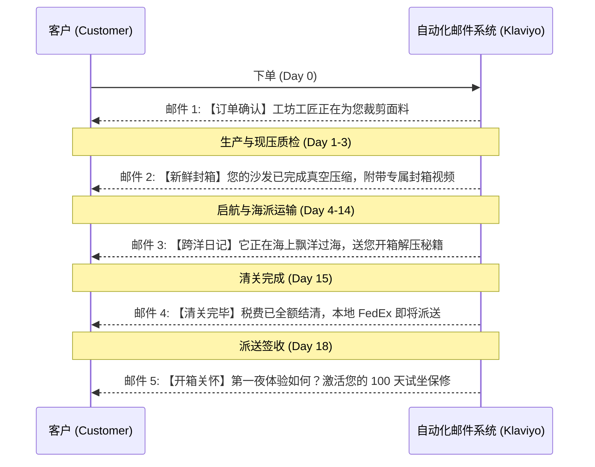

# 跨境出海 DTC 品牌定位与全套文案手册 (Brand Positioning & Copywriting Master Guide)

> **版本**：v1.0 Global DTC Edition  
> **适用渠道**：海外独立站 (Shopify / Headless)、包装箱物料、EDM 邮件营销、TikTok / Meta 广告投放  
> **商业模式**：中国工坊现制直发 (Freshly Compressed Made-to-Order) + 全球 DDP 双清包税到门 (No Overseas Warehouse, 100% Door-to-Door)

---

## 目录 (Table of Contents)

1. **[第一部分：品牌顶层战略与身份架构](#第一部分品牌顶层战略与身份架构)**
   - 品牌命名构想与哲学
   - 品牌宣言 (Brand Manifesto)
   - 品牌人设与语气语调指南 (Tone of Voice)
2. **[第二部分：核心差异化定位与标语矩阵](#第二部分核心差异化定位与标语矩阵)**
   - 品牌定位陈述 (Positioning Statement)
   - Slogan 标语矩阵 (主标语、分场景标语、痛点直击标语)
   - 4 大差异化支柱 (The 4 Brand Pillars)
3. **[第三部分：独立站全站高转化英文文案库](#第三部分独立站全站高转化英文文案库)**
   - 首页 Hero 首屏文案 (3 套方案)
   - “现压保鲜 vs 陈年库存”核心价值板块文案
   - 面料样板盒 (Swatch Kit) 申领页文案
   - PDP 商详页标准模块文案 (结构、尺寸、免工具组装)
   - 常见疑虑与信任消除 FAQ 文案 (含 DDP 与退货政策)
4. **[第四部分：包装印刷与开箱解压体验物料文案](#第四部分包装印刷与开箱解压体验物料文案)**
   - 外纸箱印刷文案 (Outer Box Print)
   - 开箱欢迎卡与解压指南 (Unboxing Guide & Welcome Card)
5. **[第五部分：DDP 履约全流程邮件营销体系 (EDM Journey)](#第五部分ddp-履约全流程邮件营销体系-edm-journey)**
   - 5 封打消等待焦虑的节点邮件文案 (制作 -> 封箱 -> 启航 -> 清关 -> 派送)
6. **[第六部分：社媒广告与短视频爆款脚本库 (Ads & Hooks)](#第六部分社媒广告与短视频爆款脚本库-ads--hooks)**
   - 3 套 TikTok / Reels 高转化爆款视频脚本

---

# 第一部分：品牌顶层战略与身份架构

## 1.1 品牌命名构想 (Brand Name Candidates)

| 品牌名构想 | 构词寓意 | 国际感与心智联想 |
| :--- | :--- | :--- |
| **FORMBOX / FORM & BOX** | Form（形态/造型）+ Box（盒装/空间） | 现代极简设计感，传递“把美好形态装进盒子”的优雅感。 |
| **MODULIV (推荐)** | Modular（模块化）+ Living（生活） | 朗朗上口，直击“模块化轻居生活”的核心品类心智。 |
| **SNAPSOFA / SNAPLIVING** | Snap（咔哒卡扣/轻松搞定） | 强化“0工具、5分钟徒手卡扣快装”的极致便捷属性。 |
| **FLEXNEST** | Flexible（灵动自由）+ Nest（巢/家） | 强调游牧生活与温暖小窝，极具情感共鸣。 |

---

## 1.2 品牌宣言 (Brand Manifesto)

> 本宣言用于品牌官网“About Us”页面、品牌画册首屏，建立与全球都市年轻人的情感共振。

### 英文版 (Official English Version):

```text
The traditional furniture industry is obsessed with heavy things.
Heavy wood. Heavy price tags. Heavy delivery trucks. And worst of all, heavy moving days.

For decades, getting a great sofa meant two things:
Paying for middlemen to ship mostly empty air, and praying it fits through your apartment door.

We believe your home should be as flexible as your life.

Welcome to MODULIV.

We didn’t just put a couch in a box. We completely re-engineered how comfort moves.
No screws. No tools. No showroom markups. No stale warehouse foam sitting in a dusty box for a year.

Every piece is crafted fresh, vacuum-sealed on-demand, and delivered in sleek, human-sized boxes that glide into any elevator, up any staircase, and into your life in under 10 minutes.

Your life is modular. Your style evolves.
Your sofa should too.

MODULIV — Big Living, Delivered in a Box.
```

### 中文释义参考:

```text
传统家具行业执迷于“沉重”的一切：
沉重的木架、沉重的账单、笨重的货车，以及搬家那天让人崩溃的重担。

几十年来，买一张体面的沙发只有两种可能：
要么花大价钱为商家运输空气买单，要么祈祷它能勉强塞进你狭窄的电梯门。

我们坚信：你的家具，应该像你的生活一样自由灵动。

欢迎来到 MODULIV。

我们不仅是将沙发装进纸箱，更是彻底重构了舒适的移动方式。
没有螺丝，无需工具，没有展厅加价，更没有在阴暗仓库里压了整整一年的死气沉沉。

每一件沙发都在接到订单后新鲜现制、即时抽真空封箱，化作一个人就能轻松抱起的小盒子——
进得去任何电梯，爬得了任何楼道，并在 10 分钟内化为你客厅里最温暖的依靠。

生活是模块化的，审美在不断生长。
你的沙发，也理应如此。

MODULIV —— 大生活，装进小盒子里。
```

---

## 1.3 品牌人设与语气语调 (Tone of Voice)

* **品牌人设**：聪慧、务实、拒绝繁琐的**都市居住极客与美学生活家**。
* **语言特征**：
  * **Empowering & Frictionless（给人掌控感、轻松自然）**：杜绝复杂的机械术语，强调“简单、徒手、咔哒成型”。
  * **Radically Honest & Transparent（极其诚实坦率）**：直面海派 DDP 15-20 天时效，自信地解释为什么“现压新鲜制作”远比“发霉的库存现货”更好。
  * **Design-Forward & Tactile（注重设计与触感）**：强调色彩、面料肌理、回弹感与空间搭配。

---

# 第二部分：核心差异化定位与标语矩阵

## 2.1 品牌定位陈述 (Positioning Statement)

> **For** 全球生活在都市公寓、追求审美与便利的年轻一代与租房游牧人群（Urban Nomads & Apartment Dwellers），  
> **MODULIV is** 专注于工坊现制直发的新一代模块化快装家居品牌（The Fresh-Pressed Modular Living DTC），  
> **That delivers** 兼具高奢面料质感、0 工具 5 分钟快装与极致便携的盒装客厅生活方案，  
> **Unlike** 本地传统高价卖场（笨重昂贵）与海外仓陈年库存白牌（颜色单一、海绵回弹不良），  
> **Because** 我们通过“订单现压保鲜封箱 + 柔性面料高定 + DDP 专线包税到门”，让用户以 1/3 的价格享受终身可扩展的无忧家居体验。

---

## 2.2 Slogan 标语矩阵 (Taglines & Copy Hooks)

### 1. 品牌主标语 (Global Main Taglines)
* **Master Slogan**: `Big Living, Small Box.`（大生活，小纸箱。）
* **Extended Slogan**: `Assemble in 5 Mins. Built for Life. Delivered to Your Door.`（5分钟免工具快装，陪你自由换个家。）

### 2. 核心功能场景标语 (Feature & Scenario Hooks)
* **针对免工具快装**：  
  `"No Screws. No Tools. No Marriage Counseling Needed."`  
  （没有螺丝，无需工具，告别装家具引发的家庭争吵。）
* **针对现压保鲜与回弹**：  
  `"Freshly Pressed, Never Stale. 100% Fluffy Resilience Guaranteed."`  
  （现做现压，拒绝陈年死库存。保证 100% 饱满蓬松。）
* **针对电梯与搬家痛点**：  
  `"Fits Every Elevator. Survives Every Move."`  
  （进得去任何微型电梯，扛得住每一次搬家。）
* **针对 DDP 直发直供**：  
  `"From Our Workshop to Your Living Room — Zero Middlemen Markups."`  
  （工坊直达客厅，剔除所有中间商加价。）

---

## 2.3 4 大差异化支柱 (The 4 Brand Pillars)

```
┌──────────────────────────────┬──────────────────────────────┐
│ 1. FRESH-PRESSED CRAFT       │ 2. 100% TOOL-FREE SNAP       │
│ 【现压新鲜工艺，100%蓬松回弹】│ 【0螺丝自锁，5分钟徒手组装】 │
│ 拒绝在仓库压了半年的死库存，  │ 告别螺丝刀与繁琐说明书，    │
│ 接单后即时压缩封箱，回弹如初。│ 机械自锁卡扣，单人咔哒成型。 │
├──────────────────────────────┼──────────────────────────────┤
│ 3. 15+ BESPOKE COLORWAYS     │ 4. ZERO-DRAMA DDP DELIVERY   │
│ 【15+种高定面料，拒绝无聊灰】│ 【标准箱直达，双清包税到门】 │
│ 法式羊羔绒、复古灯芯绒、猫抓 │ 拆解为可抱进电梯的标准小包裹，│
│ 科技布，满足一切个性审美。   │ 全程门到门包税，0隐形费用。  │
└──────────────────────────────┴──────────────────────────────┘
```

---

# 第三部分：独立站全站高转化英文文案库

## 3.1 首页 Hero 首屏文案 (3 套方案)

### 方案 A：聚焦“生活方式与自由度”（生活美学风）
* **Eyebrow Tag**: `MEET THE NEW ERA OF SEATING`
* **Main Headline**: `The Luxury Couch Designed to Move With You.`
* **Sub-headline**: `100% tool-free assembly, freshly vacuum-sealed on-demand, and delivered in human-sized boxes that fit every elevator.`
* **CTA Button 1**: `Explore Modular Sofas`
* **CTA Button 2**: `Order Free Swatch Box ($0)`
* **Trust Badges**: `★ 4.9/5 Rating` | `100-Night Risk-Free Trial` | `All Taxes & Duties Included (DDP)`

---

### 方案 B：直击“搬家/装配痛点”（硬核解决问题风）
* **Eyebrow Tag**: `ZERO TOOLS. ZERO STRESS.`
* **Main Headline**: `No Screws. No Heavy Trucks. Just 5 Minutes to Pure Comfort.`
* **Sub-headline**: `Tired of couches that get stuck in stairwells? We engineered a full-size designer sofa into sleek, manageable boxes delivered right to your doorstep.`
* **CTA Button 1**: `Shop The Collection`
* **CTA Button 2**: `See How It Snaps Together (Video)`

---

### 方案 C：主打“工坊直达与高定颜色”（极致性价比与质感风）
* **Eyebrow Tag**: `DIRECT FROM THE MAKER`
* **Main Headline**: `Custom Design Without the $3,000 Price Tag.`
* **Sub-headline**: `Freshly pressed, tailored in 15+ tactile fabrics, and shipped door-to-door with zero showroom markup.`
* **CTA Button 1**: `Customize Your Sofa`
* **CTA Button 2**: `Get Free Fabric Swatches`

---

## 3.2 “现压保鲜 vs 陈年库存”核心价值对比板块文案

> 用于首页中段或商详页，将“DDP 直发需等待 15 天”转化为用户的“品质优越感”。

```markdown
### Why "Freshly Pressed" Matters:
#### Not all boxed sofas are created equal.

| The Other Guys (Warehouse Stock) | The MODULIV Way (Fresh-Pressed DTC) |
| :--- | :--- |
| ❌ **Sitting squished in a damp warehouse for 6–12 months.** Foam structure gets fatigued and loses memory. | ✅ **Freshly crafted and vacuum-sealed only after you place your order.** 100% bounce-back guaranteed. |
| ❌ **Permanent fabric wrinkles & flattened corners** that never fully fluff up. | ✅ **Fluffs up fully within 24 hours** with smooth, crisp upholstery lines. |
| ❌ **Limited to 2 boring colors** (Grey or Beige) because warehouses hate holding inventory. | ✅ **15+ designer fabrics & vibrant shades** (Bouclé, Velvet, Corduroy, Tech-Cloth). |
| ❌ **Marked up 3x–5x** to cover expensive local warehouse rent and retail overhead. | ✅ **Fair direct pricing** — you pay for premium high-density foam, not warehouse leases. |
```

---

## 3.3 面料样板盒 (Swatch Kit) 申领页文案

> **战略作用**：降低大件下单犹豫度，把潜在客户退货率从 15% 压低至 0.8%。

* **Page Title**: `Feel the Quality in Your Own Living Room.`
* **Subtitle**: `Order your Free Fabric Swatch Box today. Get 6 tactile swatches + a $50 gift card toward your dream couch.`
* **Kit Contents Breakdown**:
  1. **6 Fabric Swatches**: French Bouclé, Vintage Corduroy, Pet-Friendly Tech Leather, Chenille Velvet.
  2. **High-Density Foam Cutout (35D vs 45D)**: Squeeze it, feel the instant bounce.
  3. **$50 Discount Card**: Redeemable on any sofa purchase over $400.
* **Shipping Callout**: `Fast Airmail Delivery (Ships within 48h, arrives in 5–7 days).`
* **CTA Button**: `Claim My Free Swatch Box ($0 + $5 Shipping)`

---

## 3.4 PDP 商详页核心模块文案 (Product Detail Page)

### 模块 1：免工具组装模块 (The Snap Assembly)
* **Headline**: `Assembly so simple, you won't even check the manual.`
* **Body Copy**:  
  `Forget Allen keys, power drills, and missing screws. MODULIV uses our proprietary heavy-duty steel interlocking brackets. Simply align, slide down, and listen for the satisfying "Click". One person. Under 5 minutes. Ready to lounge.`

### 模块 2：海绵与内部结构 (Inside The Comfort)
* **Headline**: `No Mystery Foam. Multi-Layer Ergonomic Architecture.`
* **Bullet Points**:
  - **Top Layer**: *2-inch Air-Cell Responsive Memory Foam* for cloud-like pressure relief.
  - **Middle Layer**: *35D High-Resilience Transition Foam* for posture support that won’t sag.
  - **Core**: *Pocket-Spring Grid Reinforcement* (in select modular units) for traditional sofa bounce.
  - **Certification**: *CertiPUR-US® & OEKO-TEX® Certified* — 100% free from ozone depleters, heavy metals, and harmful VOCs.

### 模块 3：可拆洗面料说明 (Pet & Life-Proof)
* **Headline**: `Spills happen. Life happens. Unzip, wash, repeat.`
* **Body Copy**:  
  `Every cushion and backrest features hidden heavy-duty zippers. Our fabrics are treated with water-repellent and anti-scratch coatings. When movie night gets messy, slip off the covers and toss them straight into the washing machine.`

### 模块 4：包装与入户规格 (Doorstep & Elevator Friendly)
* **Headline**: `Delivered in boxes you can actually carry.`
* **Dimensions Box**:  
  `Each module ships in its own reinforced parcel box (Approx. 45" x 15" x 14", under 45 lbs). Designed to fit inside compact elevators, sedan trunks, and narrow 28" doorways with zero scratches on your walls.`

---

## 3.5 常见疑虑与信任消除 FAQ 文案 (Trust-Building FAQs)

```markdown
Q1: How long does DDP shipping take, and will I have to pay customs taxes?
A: We ship direct from our master workshop via specialized DDP (Delivered Duty Paid) express lines. Total door-to-door transit is typically 14–20 business days. Best of all: ALL import duties, VAT/sales taxes, and customs clearance are 100% pre-paid by us. You will never see a surprise bill at your door.

Q2: How does a compressed sofa expand, and how long before I can sit on it?
A: Because our sofas are freshly vacuum-sealed right before dispatch, they begin expanding the second you cut open the protective eco-wrap (90% expansion in 10 minutes!). You can sit on it immediately, and it will achieve 100% full plushness within 24–48 hours.

Q3: What if I don't like it? How does the 100-Night Trial work without overseas warehouses?
A: We stand behind every stitch with our 100-Night In-Home Trial. If you are not completely in love within 100 days, reach out to our support team. We won't make you try to cram the sofa back into the box. Instead, we’ll help you donate it to a verified local charity (like Habitat for Humanity or local community shelters) and issue you a full refund upon donation receipt.

Q4: What if a single part arrives damaged?
A: Because our design is fully modular, you never need to return an entire couch for a minor flaw. If a cushion cover or bracket is damaged in transit, we will air-express a brand new replacement part to your door within 5–7 business days free of charge.

Q5: Can I expand or rearrange the sofa later?
A: Absolutely! Start with a 2-seater today, and add a chaise module or an ottoman next year when you move into a larger home. All MODULIV modules across all seasons are 100% backward-compatible.
```

---

# 第四部分：包装印刷与开箱解压体验物料文案

## 4.1 外纸箱印刷文案 (Outer Box Graphics & Copy)

```
┌────────────────────────────────────────────────────────────────────────┐
│  [ TOP PANEL ]                                                        │
│  MODULIV™                                                             │
│  ★ BIG LIVING, FLAT BOX.                                               │
│                                                                        │
│  [ FRONT PANEL ]                                                      │
│  "THE FRESH-PRESSED MODULAR SOFA"                                     │
│  • 100% Tool-Free Snap Assembly                                       │
│  • Freshly Sealed For Maximum Fluff                                   │
│  • Washable & Expandable Design                                       │
│                                                                        │
│  [ SIDE PANEL - ICONS ]                                               │
│  [📦 1-Person Lift]   [🛗 Fits Any Lift]   [⏱️ 5-Min Setup]            │
│                                                                        │
│  [ OPENING FLAP WARNING ]                                             │
│  ⚠️ CAUTION: Pure comfort inside. Open with care (No sharp knives!).  │
└────────────────────────────────────────────────────────────────────────┘
```

---

## 4.2 开箱欢迎卡与解压指南 (Unboxing Guide Insert)

> 尺寸：A5 铜版纸卡片，放置在打开纸箱的最上层。

### 正面 (Front Side):
```text
WELCOME HOME.
Your new living room just arrived.

Thank you for choosing to live lighter, smarter, and more comfortably.
This box was freshly vacuum-sealed at our workshop specifically for your home.

Ready for the magic? Flip this card over to see how to expand and snap in 5 minutes.
```

### 背面 (Back Side - 4-Step Visual Guide):
```text
STEP 1: UNROLL & UNSEAL
Lay the module flat and gently snip the inner vacuum bag. Listen to that satisfying "Hiss" — that’s fresh air breathing life into your sofa!

STEP 2: GIVE IT A FLUFF
Pat and massage the cushions. It will reach 90% fullness in 10 minutes, and 100% perfect cloud-comfort in 24–48 hours. (Pro tip: A light steam iron removes any fabric folds instantly).

STEP 3: LISTEN FOR THE "CLICK"
Align the heavy-duty steel snap brackets between modules and slide down. You’ll hear a solid "Click" — it’s locked and secure. No tools needed!

STEP 4: SINK IN & SHARE
Put your feet up. Take a photo, tag @ModuLivHome with #UnboxBigLiving for a chance to win a free matching Ottoman!
```

---

# 第五部分：DDP 履约全流程邮件营销体系 (EDM Journey)

通过 5 封有温度、极具仪式感的物流触发邮件，彻底消除跨国海派 15-20 天的客户焦虑：



### 邮件 1：下单即刻发送 (Day 0)
* **Subject**: `Confirmed! We’re tailoring your MODULIV sofa from scratch 🛋️`
* **Key Copy**:  
  `Hi [First Name], congratulations! Your order is in. We don't believe in dusty warehouse stock. Your chosen [Fabric/Color] is now being cut and stitched by our master craftsmen. We’ll notify you the moment it enters our vacuum-press seal chamber.`

### 邮件 2：封箱发货通知 (Day 3)
* **Subject**: `Freshly pressed & vacuum-sealed! Your sofa is on the move 🚀`
* **Key Copy**:  
  `Hi [First Name], great news! Your sofa has passed our 10-point resilience check and was just freshly compressed and boxed. Because it was sealed only hours ago, it will bounce back 100% fluffy when you open it. Here is your ocean tracking link: [Tracking ID].`

### 邮件 3：海运中途关怀与准备 (Day 10)
* **Subject**: `Your sofa is crossing the ocean + A quick unboxing prep guide 🌊`
* **Key Copy**:  
  `While your sofa is cruising smoothly toward your country, here are 3 quick tips to prep your living room for the 5-minute tool-free setup... (Include animated GIF of the Snap Bracket).`

### 邮件 4：清关完毕与尾程派送 (Day 15)
* **Subject**: `Customs cleared (All duties paid)! FedEx is bringing it to your door 📦`
* **Key Copy**:  
  `Your parcel has officially landed and cleared customs! As a reminder, all taxes and duties are 100% covered by MODULIV. FedEx tracking is now live. Get ready for an effortless unboxing!`

### 邮件 5：签收后 48 小时关怀 (Day 20)
* **Subject**: `How was your first lounge? Let’s make sure it’s 100% perfect ✨`
* **Key Copy**:  
  `Your sofa should now be fully fluffed and settling into its permanent cloud state. Remember, you have 100 nights to test it in real life. Need any tips on fluffing or washing covers? Reply directly to this email anytime!`

---

# 第六部分：社媒广告与短视频爆款脚本库 (Ads & Hooks)

## 6.1 爆款脚本 1：《0 螺丝·女生 5 分钟拼装挑战》 (The 5-Minute Challenge)
* **适用平台**：TikTok / Instagram Reels / YouTube Shorts
* **核心卖点**：0 螺丝、徒手组装、轻量进电梯
* **时长**：25 秒

| 时间 | 画面视觉 (Visual) | 口播/字幕 (Voiceover / On-screen Text) |
| :--- | :--- | :--- |
| **0:00 - 0:03** | 镜头一闪：一个女生单手推着一个小纸箱轻松走进狭窄电梯。 | **Text**: "I ordered a 3-seater couch... and it arrived in THESE?"<br>**VO**: "Can a full couch really fit in this tiny box?" |
| **0:03 - 0:08** | 剪开真空袋，海绵伴随治愈的“嘶嘶”漏气声极速鼓起饱满。 | **SFX**: Loud vacuum hiss ASMR.<br>**Text**: "Instant bounce! No stale foam." |
| **0:08 - 0:15** | 镜头特写：两个模块对准，徒手一推，“咔哒”一声金属锁紧。没螺丝刀。 | **Text**: "0 Screws. 0 Tools. Just SNAP."<br>**VO**: "No Allen keys, no boyfriend needed. Just listen for the click." |
| **0:15 - 0:20** | 女生整个人飞扑倒在沙发上，手抚摸法式羊羔绒面料肌理特写。 | **VO**: "It took me 4 minutes. And it feels like a $2,500 designer cloud." |
| **0:20 - 0:25** | 定格品牌 Logo、免费面料小样盒与 100 天试坐标签。 | **VO**: "Free DDP delivery to your door. Tap below to order free swatches!" |

---

## 6.2 爆款脚本 2：《现压保鲜 vs 仓库陈年死库存》 (Fresh vs. Stale)
* **适用平台**：Meta (Facebook/Instagram Feed 深度种草视频)
* **核心卖点**：解释为什么等 15 天 DDP 直发更值得
* **时长**：35 秒

```text
[Hook]: "Stop buying boxed couches that have been squished in a warehouse since 2024."
[Visual]: Left side shows a sad, wrinkled, flat foam mattress. Right side shows MODULIV's crisp, fluffy cushion.
[Body]: "When traditional brands mass-store vacuum furniture in overseas warehouses, the foam loses 40% of its elasticity over 6 months. That’s why your couch stays wrinkled and saggy.
At MODULIV, every piece is made-to-order and freshly vacuum-sealed right before it ships DDP to your door.
100% bounce-back. 15 custom fabric colors. Zero warehouse markups.
Try it risk-free for 100 nights."
[CTA]: "Claim Your Free Swatch Kit Today."
```

---

## 6.3 爆款脚本 3：《老破小楼道与电梯拯救者》 (The Staircase Nightmare)
* **适用平台**：TikTok / Meta
* **核心卖点**：解决老建筑、微型电梯、无电梯步梯楼搬运大件噩梦
* **时长**：20 秒

```text
[Scene 1]: Dramatic meme reenactment of two delivery guys getting a traditional couch stuck in a tight staircase. "PIVOT! PIVOT!" text overlay.
[Scene 2]: Cut to delivery person effortlessly dropping 3 neat MODULIV boxes at the apartment doorway.
[Scene 3]: Quick 3-second montage of snapping modules together into a huge luxury sectional.
[Headline]: "Big Comfort. Zero Delivery Drama."
[CTA]: "Shop Modular Sofas with Free Doorstep Delivery."
```

---

# 总结与使用指引 (How to Execute)

1. **建站物料提取**：将第三部分的文案直接复制应用至 Shopify 首页、PDP 商详页、Swatch 落地页及 FAQ 页面。
2. **包装盒打样**：将第四部分的尺寸与印刷图文交予包装纸箱制造厂（做成牛皮纸简约黑白双色印刷，极具性价比与高级感）。
3. **邮件系统配置**：在 Klaviyo 或 Omnisend 中按第五部分配置 5 封自动流转 EDM 模板。
4. **视频拍摄执行**：直接将第六部分的 3 套脚本交由海外 UGC 红人（TikTok Creator Marketplace）按分镜拍摄并投流。

---
*本手册由 AI 战略引擎为跨境出海 DDP 家具业务专属生成，版权与使用权归团队所有。*
