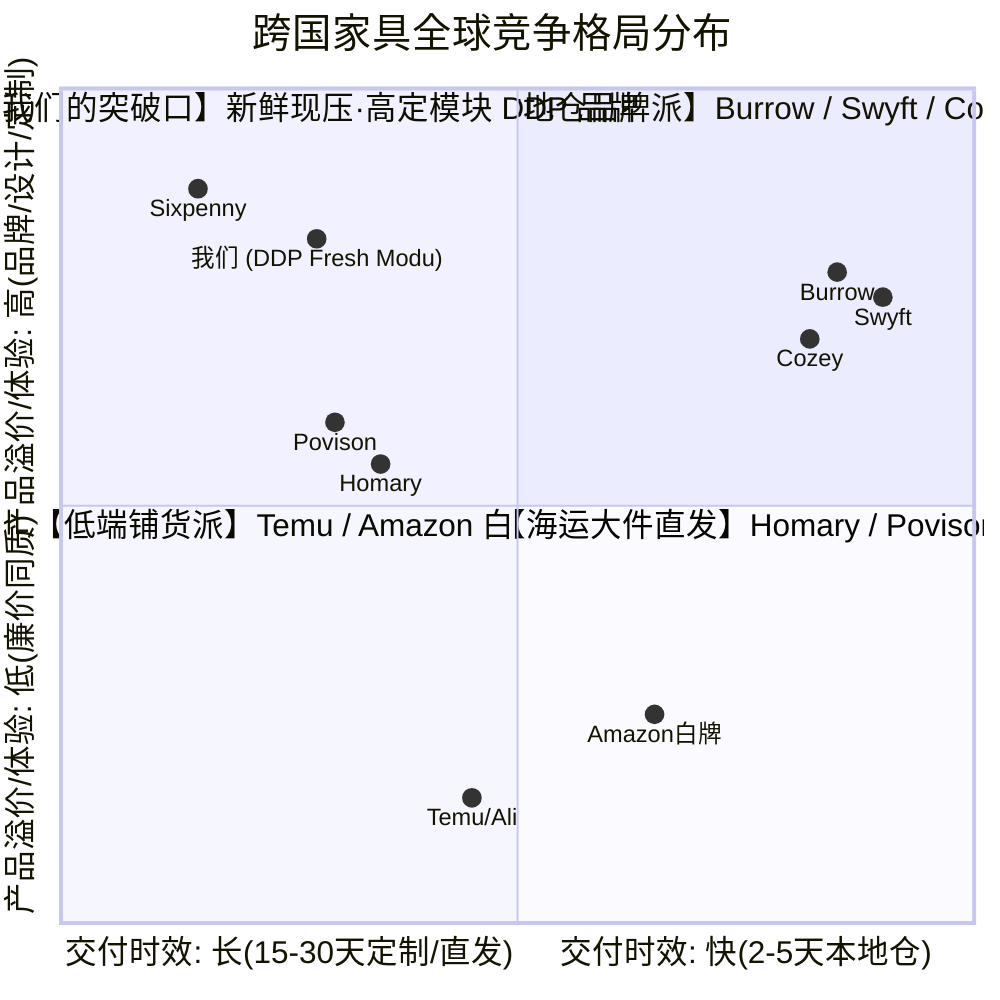
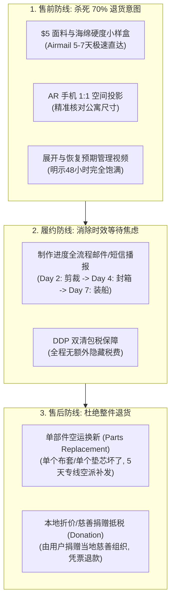

# DDP 直发模式（无海外仓）：跨国家具竞品深度拆解与差异化突围战略

---

## Executive Summary（核心战略逻辑）

在**“不建海外仓、纯采用 DDP 专线直发（海派/空派门到门包税）”**的强约束下，我们必须彻底转换竞争思路：
1. **千万不要隐瞒时效去跟海外本土仓（2-4天达）硬拼“快”**；
2. **要把“DDP 直发 15-25 天”的所谓劣势，转化为“现压定制（On-Demand Made-to-Order）、新鲜回弹（Fresh Compression）、海量面料可选、剔除 60% 仓储中间加价”的超级品牌叙事**；
3. **利用真空压缩（体积缩减 70%）的天然红利**，将国际专线 DDP 运费压缩至传统沙发的 1/3，在价格与毛利上建立不可撼动的壁垒。

---

## 一、 全球出海家具 4 大竞品流派深度拆解



### 全维度竞品对标矩阵表

| 竞品流派 | 代表品牌 | 履约与仓储模式 | 核心卖点 | 致命痛点 / 用户差评区 | 我们的超越机会 |
| :--- | :--- | :--- | :--- | :--- | :--- |
| **A. 本地海外仓 DTC 派** | **Burrow / Swyft / Cozey** | 本地海外仓储备货，UPS/FedEx 2-5 天达。 | 配送快、免工具卡扣、品牌调性好。 | **1. 颜色面料极少**（受制于海外仓备货，只有灰/米白2-3种安全色）；<br>**2. 定价极贵**（$1,200-$2,500，加价消化昂贵仓储费）；<br>**3. 海绵在仓库压缩过久，开箱回弹不良**。 | • 提供 **15+ 种高定面料颜色**（按需生产）；<br>• 售价仅为其 **1/2 ~ 1/3**；<br>• **现压现发**，海绵回弹完美。 |
| **B. 跨境大件 DDP 直发派** | **Homary / Povison** | 中国直发 DDP 专线海卡（20-35天达）。 | 意式极简/轻奢大牌设计外观，售价比海外展厅便宜 50%。 | **1. 传统实木/大理石极笨重**，破损率高达 12%-18%；<br>**2. 安装极繁琐**，螺丝几十颗；<br>**3. 无法进电梯/窄门**，末端拒收率高。 | • **全压缩/平板化包装**，0 破损率；<br>• **免工具 10 分钟卡扣快装**；<br>• 标准箱进任何电梯/窄门。 |
| **C. 定制工坊高端派** | **Sixpenny / Interior Define** | Made-to-Order（中美直发或工厂直供），工期 6-12 周。 | 亚麻全拆洗、顶级慵懒美学、高阶面料定制。 | **1. 价格极其昂贵**（$2,500-$5,000）；<br>**2. 交付周期极长**（动辄 2-3 个月）；<br>**3. 传统大件入户难**。 | • 将 10 周等待缩短为 **2-3 周**；<br>• 保持同等级的亚麻/雪尼尔拆洗质感，价格打到 **$599-$999**。 |
| **D. 平台低端白牌派** | **Amazon / Temu / AliExpress 卖家** | FBA 或 跨境小包直发。 | 极致低价（$150-$300）。 | **1. 垃圾再生棉/劣质低密棉**，3个月塌陷；<br>**2. 强烈化学刺鼻异味**；<br>**3. 廉价感强、零品牌信任**。 | • **CertiPUR-US 认证 35D-45D 高弹海绵**；<br>• 高端独立站视觉与面料小样体验。 |

---

## 二、 DDP 模式下的 5 大杀手级差异化定位（DDP Differentiation Pillars）

既然无法做到“本地2天极速达”，我们就必须将**“DDP 直发”包装成用户甘愿等待 15-20 天的不可替代价值**：

```
┌────────────────────────────────────────────────────────────────────────┐
│              DDP 独立站独家品牌定位：The Fresh-Pressed Atelier         │
│                 【现压工坊直达 · 拒绝陈年库存的模块新家居】            │
├────────────────────────────────────────────────────────────────────────┤
│ 核心叙事 Slogan:                                                       │
│ "Freshly compressed upon order. Tailored to your color. Direct to door."│
│ “每张沙发都在下单后新鲜现压封箱，15种高定色彩，剔除中间商直达你家。”    │
└────────────────────────────────────────────────────────────────────────┘
```

### 1. 差异化卖点 ①：【现压新鲜回弹保证】（Fresh-Compression Guarantee）
*   **行业残酷真相**：海外仓现货的压缩沙发，往往在箱子里被高压压榨了 **6-12 个月**。海绵分子链疲劳，开箱后极易出现“边角凹陷、面料永久褶皱、回弹不到位”的大面积客诉。
*   **我们的降维打击叙事**：
    > *“Unlike warehouse sofas sitting squished in boxes for months losing their bounce, every piece of our sofa is **freshly crafted, pressed, and vacuum-sealed only after you place your order**, ensuring 100% fluffy resilience within 24 hours.”*
    *   **买点**：把“等待直发”升华为“为了极致新鲜回弹体验的品质坚守”。

### 2. 差异化卖点 ②：【15+ 种高定面料色盘，拒绝无聊灰白】（On-Demand Customization）
*   海外仓竞品因为怕压库存，全站只有 Charcoal Grey 和 Ivory White 2 个无聊颜色。
*   **我们依托国内柔性供应链**：提供 **法国奶油羊羔绒（Bouclé）、法式复古灯芯绒（Corduroy）、防猫抓科技布、复古墨绿/焦糖雪尼尔** 等 15+ 种高端流行色。
*   用户在宜家和本地海外仓买不到个性化颜色，在传统定制店要等 10 周并花 $3,000；而我们在独立站以 **$699 + 18天直达**，形成绝杀吸引力。

### 3. 差异化卖点 ③：【免工具自锁卡扣 + 0 螺丝安装】（Zero-Hardware Snap System）
*   传统跨境直发家具（如 Homary）最被海外诟病的就是“安装说明书像天书、螺丝几十包、需要自己准备电钻”。
*   我们主打：**“100% Tool-Free” 榫卯/自锁金属卡扣**。连扳手都不需要，开箱、展开海绵、卡扣对准一按“咔哒”成型，单人 5-10 分钟搞定。
*   **社交视频黄金卖点**：拍摄《女生徒手 5 分钟拼完三人沙发且没用一颗螺丝》，广告点击率（CTR）大幅飙升。

### 4. 差异化卖点 ④：【标准快递分箱入户，进任何狭窄空间】（Zero-Lift/Stair Drama）
*   直发采用 DDP 专线海派/空派，尾程对接本地 **FedEx / UPS Ground / DPD / Aramex**。
*   将三人沙发拆解为 **3 个标准小纸箱（每箱 < 20kg）**：
    *   普通女孩子单人即可抱进老式步梯楼、微型公寓电梯；
    *   彻底避开卡车大件派送（Truck Freight）需要预约时间、加收上楼费（$150+）甚至卡在楼道被拒收的巨大风险。

### 5. 差异化卖点 ⑤：【透明工厂 Direct-from-Maker，价格省 60%】
*   独立站直接展示生产制造透明过程（CNC 裁切、环保胶水喷涂、真空封箱过程）。
*   直击痛点文案：“No middlemen. No expensive local showrooms. No dusty warehouses. Just premium seating direct from the makers to your living room.”

---

## 三、 DDP 模式下的“逆向物流与零退货（Zero-Return）”闭环体系

> [!CAUTION]
> **DDP 模式的最大生死线**：一件从中国发往美国/欧洲/中东的沙发，如果客户要求退货，**绝无可能再反向海运退回中国**（反向运费甚至高于商品货值）。
> 必须在独立站设计一套**把退货率压到 1% 以下的“零退货防线”**！



### 零退货三大实战机制：

1. **面料小样盒（Swatch Kit）先遣队**：
   * 在独立站首屏置顶：“Not sure about color? Order the Free Fabric Swatch Box.”
   * 包含 6 款面料小样 + 35D/45D 海绵触感切块 + 一张 $50 现金抵扣券。
   * **物流方式**：小样盒走平邮/专线小包（运费仅 $2-3，5-7天送达）。
   * **效果**：摸过真实面料并测量过尺寸的用户，下单后退货率低于 0.8%！
2. **模块部件空运换新（Modular Spare Parts by Air）**：
   * 传统沙发某处开线就要整套退换；模块化沙发如果扶手面料受损，从国内**空派单件布套（运费仅 $8-$12）5天寄拢**，立刻化解纠纷。
3. **“以捐代退”（Local Charity Donation Protocol）**：
   * 极少数用户执意退货时，客服提供合作的当地慈善组织清单（如 US Habitat for Humanity、UK British Heart Foundation、UAE Red Crescent）。
   * 用户将沙发捐给慈善机构并拍照/上传收据，独立站立刻全额退款。品牌获得慈善 ESG 形象，并可抵扣部分企业税费，彻底省去巨额退货运费。

---

## 四、 DDP 模式下的单件经济模型核算（Unit Economics）

以一款主推的 **3人位免工具模块压缩沙发（3箱装）** 为例，测算中美/中欧 DDP 门到门财务模型：

```
┌─────────────────────────────────────────────────────────────┐
│             3人位模块沙发 DDP 门到门单件财务模型 (USD)       │
├─────────────────────────────────────────────────────────────┤
│ 独立站终端零售价 (Retail Price, 包邮包税):          $699.00  │
├─────────────────────────────────────────────────────────────┤
│ 1. 出厂制造成本 (BOM: 35D复合海绵+卡扣+雪尼尔布套):  -$115.00  │
│ 2. 国际 DDP 专线海派到门 (3箱合计 0.16 CBM / 22kg): -$68.00  │
│ 3. 独立站 CAC 获客成本 (Meta / Google 广告投流):    -$140.00  │
│ 4. 支付通道与平台费 (Stripe 2.9% + Shopify 2%):      -$34.00  │
│ 5. 售后备件/保险/小样盒摊销:                          -$25.00  │
├─────────────────────────────────────────────────────────────┤
│ ★ 单件纯利润 (Net Profit):                         $317.00  │
│ ★ 纯净利润率 (Net Margin):                            45.3% │
└─────────────────────────────────────────────────────────────┘
```

> **对比优势**：
> - 传统大件沙发 DDP 运费需要 $250-$350（因为不可压缩算大体积重）；
> - **真空压缩后 DDP 专线海派仅需 $60-$75**，单件省出近 $200 净利润！

---

## 五、 DDP 独立站落地实操策略与页面转化配置

### 1. 独立站首页与商详页（PDP）必须展示的“打消疑虑模块”

1. **“Freshly Made & Compressed” 专属标识**：动态小图标展示“现做现封箱，确保100%饱满回弹”。
2. **“How It Ships (DDP)” 动画示意**：
   * 示意图展示 3 个整齐的小箱子被快递员直接搬上公寓电梯，而不是一辆巨大的卡车堵在门口。
3. **“Track Your Handcrafting Journey” 物流透明度**：
   * 将 18 天的海派等待细化为 5 个仪式感节点：
     - *Day 1-3*: Fabric cut & structural test
     - *Day 4*: Fresh vacuum-compression & boxed
     - *Day 5-14*: Ocean express voyage
     - *Day 15*: Customs cleared (All taxes paid by us)
     - *Day 16-18*: Local FedEx doorstep delivery
4. **Tool-Free 3D 拼装动图（GIF / WebGL）**：3秒循环展示金属卡扣对准咔哒合上，无需任何螺丝。

### 2. 广告投放（Meta / TikTok）爆款打法

* **素材脚本 A（反差开箱）**：
  * *前 3 秒*：快递员送来 3 个不大的纸箱，文案：“Is this really a full 3-seater couch?”
  * *第 4-8 秒*：剪开塑料袋，海绵伴随嘶嘶声极速膨胀恢复饱满。
  * *第 9-15 秒*：徒手将 3 个模块咔哒扣紧，套上高定墨绿雪尼尔布套，整个人跃身扑上去躺平。
  * *结尾*：“$699 free shipping, 100-night trial.”

---
*本方案专为 DDP 直发无海外仓模式量身定制，将供应链时效劣势全面反转为高定与品质优势。*
