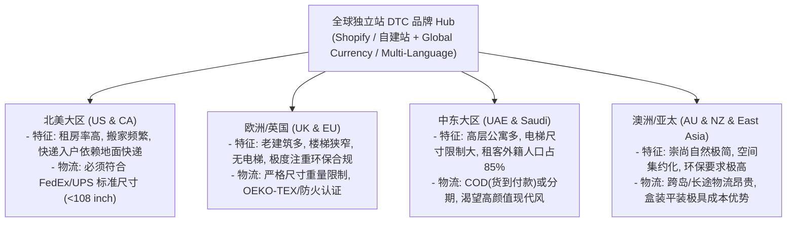
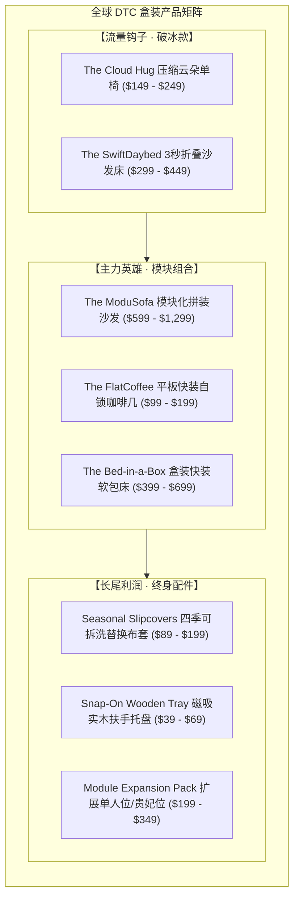
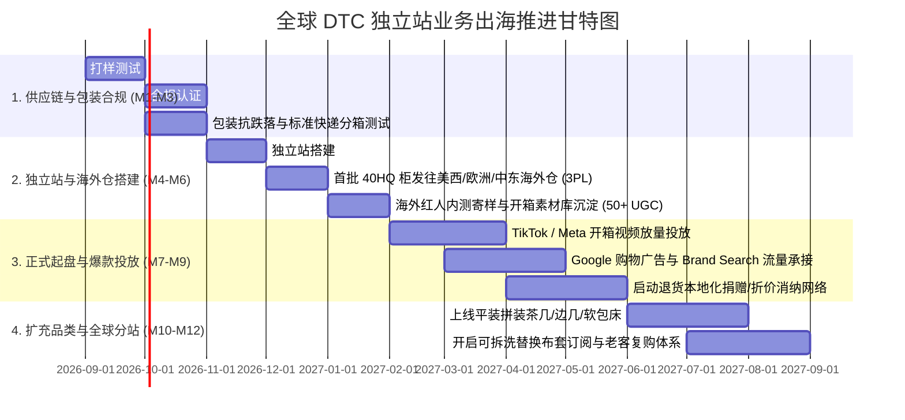

# 全球出海 DTC 独立站：压缩沙发与简易拼装家具品牌定位与全链路战略方案

---

## Executive Summary（全球化出海执行摘要）

在做**“全球出海 + DTC 独立站”**的前提下，压缩沙发与简易拼装家具不再只是“省运费”的物理产品，而是一个**“解决全球都市居住流动性与物流最后一公里痛点”的跨国 DTC 品牌商业模型**。

全球大件家具跨境电商的致命难点在于：**海外末端大件派送（White Glove Delivery）费用高昂（单件 $150-$300）、长途海运体积虚高、传统家具安装复杂、以及退货逆向物流极其昂贵**。
本方案专门针对**“全球不限市场、独立站为核心阵地”**的商业模式，为您深度梳理全球主力区域市场特征、4大全球定位流派，并打造一套**高客单、低退货、自带社交传播与高复购（LTV）的全球化 DTC 品牌全案**。

---

## 一、 全球四大核心市场特征与物流红利地图

全球化并不是盲目铺全球，而是通过独立站统一品牌心智，由成熟的**区域海外仓（3PL）**进行标准包裹（Parcel）辐射。



| 区域市场 | 主流居住痛点 | 核心竞品与市场空白 | 物流与认证要求 |
| :--- | :--- | :--- | :--- |
| **北美 (美国/加拿大)** | 纽约/波士顿/多伦多等公寓楼梯狭窄；传统家具等待周期长（6-12周）；租客平均1.5年搬一次家。 | Burrow, Cozey, Article, Floyd。<br>**空白**：$300-$700 价格带兼具“高颜值美学+免工具”的品质空白。 | FedEx/UPS Ground 尺寸内（避免超大包裹附加费 Oversize Surcharge）；CertiPUR-US 认证。 |
| **欧洲 (英国/德/法等)** | 多数百年老公寓没有电梯，楼道极陡极窄；重视环保与可持续（ESG）。 | Swyft, Tylko, IKEA。<br>**空白**：模块化且可全拆洗、多色布套定制的灵动设计。 | 英国 BS5852 防火认证；欧盟 CE/OEKO-TEX 认证；严禁过度包装。 |
| **中东 (阿联酋/沙特)** | 外籍白领占比极高（迪拜 85%+），租房周期短（1-3年）；大量高层住宅电梯对传统3米大沙发进不去。 | IKEA, Home Centre, Danube。<br>**空白**：极度缺乏本地化 Sofa-in-a-box 品牌，传统卖场信息不透明。 | 沙特 SASO 认证，阿联酋 DDP 派送到门，支持 Tabby/Tamara 先买后付。 |
| **澳洲/亚太** | 运费高昂；年轻人注重户外自然与松弛感生活方式。 | Koala, Eva。<br>**空白**：多元化面料风格与模块化扩展组合。 | 严格植物检疫（若含木架需熏蒸认证），极简包装。 |

---

## 二、 全球 DTC 独立站四大定位流派深度对比

```
                        【高溢价 · 品牌审美驱动】
                                   ▲
                                   │
              流派 2               │               流派 1（★全球首推）
     【大牌平替·美学解压空间】        │      【全球游牧·乐高式模块快享家】
     - 调性: 设计师画廊 / 氛围感    │      - 调性: 极简极智 / 自由生长 / 便捷
     - 溢价点: 触感面料 / 治愈开箱  │      - 溢价点: 0螺丝5分钟快装 / 搬家带得走
     - 客单: $399 - $899           │      - 客单: $499 - $1,299
                                   │
  ─────────────────────────────────┼─────────────────────────────────►【功能 · 结构系统驱动】
                                   │
              流派 4               │               流派 3
     【小空间黑客·极致变形多功能】   │      【低碳循环·零浪费可持续家居】
     - 调性: 空间利用率 / 储物变形 │      - 调性: 纯天然 / B-Corp / 陪你一生
     - 溢价点: 沙发床秒切 / 隐藏储物 │      - 溢价点: 碳中和配送 / 终身换套只换不扔
     - 客单: $299 - $699           │      - 客单: $799 - $1,899
                                   │
                                   ▼
                        【实用性价比 · 场景驱动】
```

### 4 大流派深度拆解：

#### 流派 1：The Modular Living System（全球游牧·乐高式模块快享家）——【★全球 DTC 最优解】
*   **核心主张**：“The Sofa That Grows and Moves With You”（唯一一款能陪你搬家、随生活长大的沙发系统）。
*   **产品逻辑**：标准化单人/双人/贵妃模块 + 免工具卡扣（Snap-Lock）+ 独立平装箱 + 全拆洗布套。
*   **为什么最适合全球独立站**：
    1.  **打消大件顾虑**：买大沙发容易买错尺寸，模块化让用户可以先买1-2个模块试水，后续像乐高一样加购。
    2.  **极高复购率（LTV）**：用户搬大房子买扩展包、换季节买新布套、加购拼装边几，打破传统家具“一生只买一次”的魔咒。
    3.  **全球通用叙事**：无论在纽约、伦敦还是迪拜，年轻一代都是“都市游牧民（Urban Nomads）”，对搬家友好型道具有强烈共鸣。

#### 流派 2：The Sensory & Aesthetic Living（大牌平替·高感官美学盒）
*   **核心主张**：“High-End Designer Aesthetics, Delivered in a Box”（千刀级设计师高奢美学，一箱直达）。
*   **产品逻辑**：聚焦高颜值全海绵造型（云朵沙发、泡芙异形单椅、毛毛虫褶皱椅）+ 极致触感面料（雪尼尔、羊羔绒、复古灯芯绒、猫抓科技布）。
*   **为什么适合独立站**：
    *   **社媒原生流量极强**：开箱膨胀 ASMR、治愈系软装改造在 TikTok / Instagram / Pinterest 上完播率极高，爆款视频带单转化率高。
    *   **门槛相对低**：无复杂五金框架，利用中国海绵数控裁切与真空压缩优势，快速出海测款。

#### 流派 3：The Circular & Sustainable Living（低碳循环·生态极简主义）
*   **核心主张**：“Zero-Air Freight, Built to Last, Designed to Renew”（拒绝为空气运输买单，只换部件不扔沙发）。
*   **产品逻辑**：CertiPUR-US 环保海绵、可循环金属铝/实木骨架、无胶水榫卯卡扣，包装 100% 可降解。
*   **适用人群**：欧美高知中产、环保主义者（对 ESG、无毒、0甲醛有执念）。

#### 流派 4：Space-Hacking Micro-Living（空间黑客·多功能变形家具）
*   **核心主张**：“Double Your Apartment’s Living Space”（让每一平米都物超所值）。
*   **产品逻辑**：压缩沙发床 3 秒折叠切换、底部隐藏储物仓、平板自锁茶几秒变工作台。
*   **适用人群**：全球超小户型（Studio）、合租单间、Airbnb 民宿房东。

---

## 三、 【核心推荐方案】全球化 DTC 品牌定位全案

### 1. 品牌顶层设计（Global Brand Identity）

```
┌────────────────────────────────────────────────────────────────────────┐
│ 品牌定位: 新一代全球化模块化快装轻居品牌 (Global Modular Living DTC)  │
├────────────────────────────────────────────────────────────────────────┤
│ 英文品牌名构想: ModuBox / FormLiving / FlexCouch / LivinBox             │
│ 英文主 Slogan: “Big Living, Flat Box. Assemble in 5 Mins, Built for Life.” │
│ 中文主 Slogan: “大生活，小纸箱。5分钟免工具快装，陪你自由换个家。”     │
├────────────────────────────────────────────────────────────────────────┤
│ 品牌核心承诺 (The 4 Zeroes):                                           │
│ 1. Zero Tools (0 工具，徒手卡扣 5 分钟成型)                            │
│ 2. Zero Moving Drama (0 搬家焦虑，进任何电梯/车后备箱)                 │
│ 3. Zero Mystery Foam (0 劣质杂棉，35D+高回弹独立弹簧复合结构)          │
│ 4. Zero Regret (100天无忧试睡/试坐 + 免费面料小样盒先行)               │
└────────────────────────────────────────────────────────────────────────┘
```

### 2. 全球独立站“1+N”产品矩阵体系



---

## 四、 破解全球 DTC 独立站大件家具“信任鸿沟”与转化漏斗

大件家具在独立站上最大的阻力是：**“没坐过不敢买”、“怕有色差”、“怕质量差退货麻烦”**。
通过以下 4 层转化武器彻底击穿顾虑：

```
【第 1 步：低门槛破冰】
  👉 "Order a Free Swatch Kit"（免费/低价面料小样盒）
     - 用户付 $5 运费或免费申领 6 款热门面料（雪尼尔/猫抓科技布等）与海绵硬度切片。
     - 包装盒内附赠一张 $50 购沙发抵扣券。
     - 效果：大幅过滤非精准流量，锁定高意向用户，退货率降低 60%。
       ↓
【第 2 步：沉浸式体验与尺寸模拟】
  👉 "AR Room Placement + 3D 爆炸图"
     - 手机直接在房间里投射沙发实际尺寸，查看电梯能否进、客厅放不放得下。
     - 3D 拆解动画：直观展示海绵分层、独立弹簧、免工具卡扣如何咔哒锁死。
       ↓
【第 3 步：风险逆转承诺】
  👉 "100-Night Risk-Free Trial"（100 天无忧试坐）
     - 若 100 天内不满意，全额退款。
       ↓
【第 4 步：逆向物流与退货解决方案（关键）】
  👉 "Donation-over-Return"（以捐代退）
     - 传统大件退货运费 $150+ 且海绵无法重压，极度亏损。
     - 方案：若用户要退货，引导其直接捐赠给本地慈善组织（如 Habitat for Humanity、Salvation Army 或本地二手平台），凭捐赠凭证直接退款，抵扣企业海外税费。
```

---

## 五、 全球供应链、海外仓与履约模型（Unit Economics）

### 1. 单件 3 人位模块沙发跨国履约经济模型（以美线为例）

| 项目 | 传统跨境大件沙发 | 本方案（模块压缩平装沙发） | 降本优势 |
| :--- | :--- | :--- | :--- |
| **40HQ 集装箱装载量** | 约 35 - 45 套 | **约 140 - 180 套（箱体优化）** | **单套海运费直降 70%** |
| **单套头程海运成本** | 约 $120 - $180 | **约 $35 - $55** | 单套节省 $100+ |
| **海外仓仓储费 (月/套)** | 约 $40 - $60 (大体积占地) | **约 $10 - $15** | 仓储周转压力大幅减轻 |
| **末端派送费用** | **$180 - $300** (卡车大件派送) | **$35 - $65** (FedEx/UPS 标准地面包裹) | **彻底避开 Oversize 附加费** |
| **综合履约物流成本占比** | 占售价 35% - 45% | **占售价 12% - 18%** | **毛利空间提升 25%+** |

### 2. 包装设计与物流黄金规则

> [!IMPORTANT]
> **全球快递尺寸红线**：
> - **单箱毛重**：务必控制在 **25kg (55 lbs) 以内**，确保单人快递员可徒手搬运。
> - **长+周长公式**：`Length + 2*(Width + Height) < 130 inches (330cm)`，坚决避免触发 FedEx/UPS/DHL 的 Freight 大件超限罚款。
> - **模块化分箱策略**：3人位沙发拆分为 **3 个标准独立纸箱** 发货，即使一个箱子丢失或破损，仅需补发单箱，无需整套重发。

---

## 六、 独立站流量与社媒增长飞轮（Go-To-Market Engine）

```
┌─────────────────────────────────────────────────────────────┐
│                 全球 DTC 独立站全域获客引擎                  │
├──────────────────────────────┬──────────────────────────────┤
│ 1. 顶级爆款视频 (TikTok/Reels) │ 2. 高意向搜索承接 (Google Ads) │
│  - "Unboxing a whole couch"  │  - "Modular sofa in a box"   │
│  - "Couch in a box vs Stairs"│  - "Tool free sofa delivery" │
│  - 开箱真空漏气瞬间 ASMR     │  - "Best couch for apartment"│
├──────────────────────────────┼──────────────────────────────┤
│ 3. 审美生活方式 (Pinterest)   │ 4. 联盟与公关 (PR & Creators)│
│  - Japandi / Mid-Century 搭配│  - 室内设计师/租房改造博主测评 │
│  - 小户型客厅改造 Moodboard  │  - 免费寄样换取真实开箱长视频 │
└──────────────────────────────┴──────────────────────────────┘
```

---

## 七、 0-12 个月全球独立站出海落地路线图



---
*本方案专为全球跨国 DTC 独立站打造，兼顾全球物流红利、消费者信任转化与长效品牌壁垒。*
