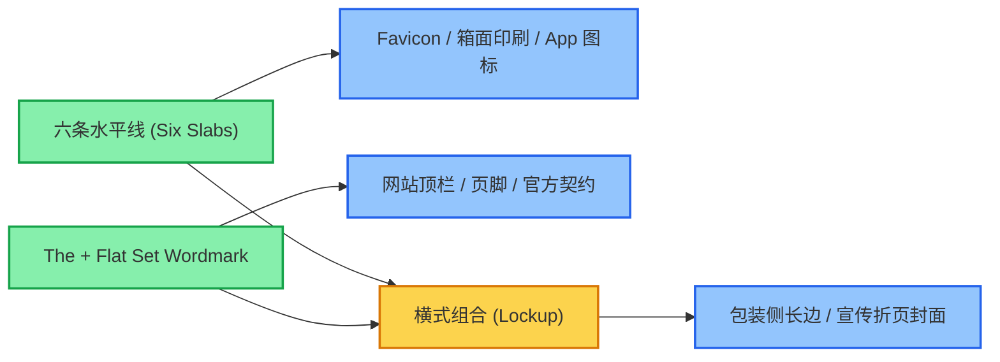

# The Flat Set 视觉识别系统（VI 规范手册）

> **品牌名称**：The Flat Set  
> **核心主张**：Your entire home. Delivered in 6 flat boxes.（6 个扁平包装箱装下你的整套家）  
> **设计语言**：Warm Japandi Editorial（日式暖调社论风）  
> **官网门面**：`theflatset.com` · 内部开发预览：`flatpack.dev.canbee.cn`  
> **交互手册页**：[`stitch/brand.html`](../stitch/brand.html)（支持浏览器直接交互与 Command+P 印刷导出 PDF）

---

## 1. 品牌哲学与设计定位

The Flat Set 专为都市青年租客、首套房置业者与高品质民宿房东打造全屋整装家具体系。
我们拒绝传统大家具昂贵的配送楼梯费、复杂的组装说明书与冗长货期；以**「6 个扁平箱、60 分钟免螺丝徒手榫卯、全球 DDP 完税送货上门」**为核心产品力。

在视觉识别（VI）上，我们不凭空捏造繁琐的图案，而是将**现有站点的 Warm Japandi 社论气质升格为长青品牌资产**：
- **六条水平线（The Six Slabs）**：直接同构于承载全屋的 6 个牛皮纸扁平箱；
- **Playfair Display 斜体 "The" 与 600 字重 "Flat Set"**：奠定建筑美学与高阶 DTC 质感；
- **天然材质色彩矩阵**：源自白橡木、黑胡桃木、烧制陶土与玄武岩水墨，不设炫目渐变与虚饰。



---

## 2. 标志系统规范 (Logo Architecture)

### 2.1 主文字标 (Wordmark)
- **法定全称**：必须完整呈现 **The Flat Set**，严禁省略定冠词 "The" 或缩写为 "FlatSet"。
- **字型结构**：
  - “The”：Playfair Display Italic (400)，字号为主字标的 58% 左右，字距 tracking `+0.04em`。
  - “Flat Set”：Playfair Display Semibold (600)，Title Case，字距 tracking `-0.02em`。
- **色彩规范**：
  - 浅底：Basalt Charcoal `#1A1C1D` 印在 Warm Porcelain `#F9F8F6` 上。
  - 深底：Warm Porcelain `#F9F8F6` 反白印在 Basalt Charcoal `#1A1C1D` 或深木色底上。

### 2.2 两行折叠版 (Stacked Wordmark)
- **应用场景**：移动端视口（<768px）导航顶栏、狭长箱侧标贴、社媒故事封面。
- **排版结构**：上行 “The”，下行 “Flat Set”，左端垂直绝对对齐。

### 2.3 六板印 (The Six Slabs Icon)
- **概念**：正方形视框内整齐排列 6 条等厚水平矩形。
- **网格规范**：基于 8px 网格，在 64×64 视框中，条厚 4px，间隙 5px。
- **特征细节**：最下方第 6 条宽度略短 8%（向右缩进），隐喻“最底下的底座箱子滑入家门”。
- **单色牛皮纸印章**：专供海外代工厂外箱水印柔版印刷。

### 2.4 Favicon 与 App 磁贴
- **标准规格**：深陶土 Burnt Oak `#8A4725` 圓角方块（rx: 14/64），内嵌瓷白 Warm Porcelain `#F9F8F6` 六板印。

---

## 3. 色彩系统矩阵 (Color System)

| 色彩角色 | 色彩名称 | HEX | RGB | CMYK 近似 | 应用规范 |
| :--- | :--- | :--- | :--- | :--- | :--- |
| **主墨色** | Basalt Charcoal | `#1A1C1D` | 26, 28, 29 | 70, 60, 55, 80 | 文字标主色、主 CTA 胶囊、高对比大标题 |
| **画布底色** | Warm Porcelain | `#F9F8F6` | 249, 248, 246 | 2, 2, 3, 0 | 全站背景底色、信函纸张、白色反白空间 |
| **促销强调** | Fired Terracotta | `#A85F3B` | 168, 95, 59 | 25, 68, 85, 12 | 顶部公告条、优惠码高亮、限时现压价签 |
| **深木强调** | Burnt Oak | `#8A4725` | 138, 71, 37 | 28, 75, 90, 25 | Favicon 底色、交互 Focus 边框、原木质感 |
| **认证与生态** | Soft Sage | `#545C50` | 84, 92, 80 | 55, 40, 55, 25 | FSC 原木认证、无氟面料与 ESG 环保标签 |
| **发丝结构线** | Hairline Stone | `#EBEAE8` | 235, 234, 232 | 5, 4, 5, 0 | 矩阵对比表格边框、卡片微阴影边线 |
| **箱面牛皮纸** | Natural Kraft | `#D9BD9E` | 217, 189, 158 | 15, 25, 40, 5 | 5层瓦楞原纸，仅允许单色水性黑/陶土印刷 |

---

## 4. 字体排版层级 (Typography Hierarchy)

| 层级 Token | 字体家族 | 字重 / 字号 / 行高 | 典型应用 |
| :--- | :--- | :--- | :--- |
| `display-lg` | Playfair Display | 600 / 64px / 1.1 / `-0.02em` | 首页 Hero 主标、全套一居室大看板 |
| `headline-lg` | Playfair Display | 500 / 48px / 1.2 | 章节标题、对比矩阵大标题 |
| `headline-sm` | Playfair Display | Italic 400 / 24px / 1.4 | 媒体书评社论引语、品牌誓言 |
| `body-lg` | Plus Jakarta Sans | 400 / 18px / 1.6 | 导读段落、材质深度介绍 |
| `body-md` | Plus Jakarta Sans | 400 / 16px / 1.6 | 正文、FAQ 问答详情、购物车参数 |
| `label-md` | Plus Jakarta Sans | 600 / 14px / 1.2 / `+0.05em` | 导航栏、全大写眉题、胶囊按钮、箱号麦头 |

---

## 5. 6 只包装箱外箱印刷与麦头规范 (Packaging Specs)

所有套件拆解为 6 个符合单人搬运工学标准（1-PERSON LIFT）的牛皮纸箱：

```
┌────────────────────────────────────────────────────────┐
│ THE FLAT SET               BOX 01 / 06                 │
│ ══════════════             MODUSOFA OAK BASE & RAILS   │
│ 24 KG · 1-PERSON LIFT      115 × 50 × 20 CM            │
│ ────────────────────────────────────────────────────── │
│ [ ≡≡≡≡≡≡ 六板印章 ]        FSC-C123891 100% WHITE OAK  │
│                            TOOL-FREE SNAP-LOCK SYSTEM  │
└────────────────────────────────────────────────────────┘
```

1. **箱 01**：ModuSofa 纯实木底框与五金卡扣（115 × 50 × 20 cm / 24 kg）
2. **箱 02**：ModuSofa 羊圈呢座垫与模块靠包（100 × 70 × 35 cm / 18 kg）
3. **箱 03**：Oak Coffee Table 极简全实木茶几（90 × 60 × 12 cm / 14 kg）
4. **箱 04**：Dining Multi-Bench 两用长凳（120 × 35 × 15 cm / 16 kg）
5. **箱 05**：SnapBed Queen 边框侧梁与重力榫卯（215 × 25 × 18 cm / 22 kg）
6. **箱 06**：SnapBed 桦木卷式排骨架 + 悬浮床头柜（165 × 40 × 15 cm / 20 kg）

---

## 6. 品牌绝对禁则 (Brand Integrity: DON'Ts)

1. **严禁遗漏冠词**：不可写作 “FlatSet” 或 “Flat Set”。
2. **严禁陶土色文字标**：陶土色 `#A85F3B` 仅作为促销提示点缀，主标志必须为玄武岩墨色 `#1A1C1D` 或瓷白反白。
3. **严禁修改六板印数量**：横线条数必须精确为 6 条，不可增减为 3 条或 5 条。
4. **严禁添加发光或伪 3D 渐变**：不得使用浮雕、投影、金属拉丝等过时拟物效果。

---

## 7. 资产文件清单与索引

所有标准矢量资产位于代码库：
- `stitch/assets/brand/` 与 `public/assets/brand/`：
  - `mark.svg`：六板印标准黑色版
  - `mark-on-dark.svg`：六板印反白版
  - `favicon.svg`：深陶土底圆角 Favicon 图标
  - `wordmark.svg`：单行桌面版文字标
  - `wordmark-on-dark.svg`：深底反白文字标
  - `wordmark-stacked.svg`：两行折叠手机版文字标
  - `lockup.svg`：图文横排组合标
  - `mark-mono-kraft.svg`：牛皮纸外箱柔印单色带框印章
